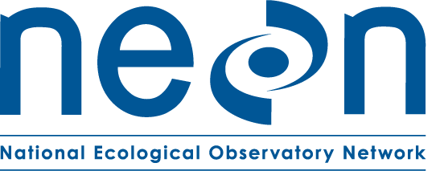

# Welcome to the NEON Data Skills Git Repo!

NEON Data Skills provides tutorials and resources for working with scientific 
data. NEON (National Ecological Observatory Network) is an ecological observatory,
funded by the National Science Foundation and operated by Battelle, that will 
collect and provide open data for 30 years. 

Check out the NEON Data Skills portal for the online resources and upcoming events: 
[www.neondataskills.org](http://www.neondataskills.org)

Check out our website for more: 
[http://www.neonscience.org](http://www.neonscience.org "National Ecological Observatory Network")

## About NEON Data Skills 

Education is a key component of the NEON mission. As such this site serves to 
facilitate use of data in both science and education.

NEON Data Skills provides self-paced tutorials, workshops, in depth Data Institutes,
science videos, teaching modules, and teaching data subsets to enhance researchers' 
ability to work with heterogeneous ecological data. 

## Questions?

Having a problem getting something to work or want to know why the repo is setup 
in a certain way? Email us **neondataskills -AT- BattelleEcology.org** or 
[file a GitHub Issue](https://github.com/NEONScience/NEON-Data-Skills/issues). And 
if you have a cool resource that you think would add to the site, please let us 
know!

---

## Credits & Acknowledgements
***

<!-- HTML tags to produce image, resize, add hyperlink. -->
<!-- ONLY WORKS WITH HTML or GITHUB documents -->

The National Ecological Observatory Network is a project solely funded by the 
National Science Foundation and managed under cooperative agreement by Battelle. 
Any opinions, findings, and conclusions or recommendations expressed in this 
material are those of the author(s) and do not necessarily reflect the views of 
the National Science Foundation.

## License
***

GNU AFFERO GENERAL PUBLIC LICENSE Version 3, 19 November 2007

## Disclaimer
***

*Information and documents contained within this repository are available as-is. 
Codes or documents, or their use, may not be supported or maintained under any 
program or service and may not be compatible with data currently available from 
the <a href="data.neonscience.org" target="_blank"> NEON Data Portal</a>.*
