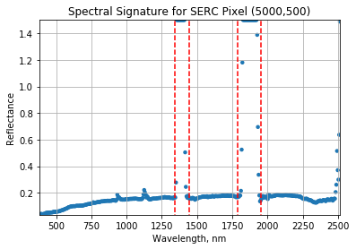

# Plot a Spectral Signature

A spectral signature is a plot of the amount of light energy reflected by an object throughout the range of wavelengths in the electromagnetic spectrum. The spectral signature of an object conveys useful information about its structural and chemical composition. We can use these signatures to identify and classify different objects from a spectral image. 

For example, the atmosphere, soil, water, and vegetation have spectral signatures of distinctly different shapes, as illustrated in the following figure:
<p>
<center><strong>Example Spectral Signatures of Atmosphere, Soil, Water, and Vegetation</strong></center>

<center><font size="2">Figure: (Molero and Garzón, 2012)</font></center>
<center><font size="2">http://remotesensing.spiedigitallibrary.org/article.aspx?articleid=1352329</font></center>
</p>
Vegetation has a unique spectral signature characterized by high reflectance in the near infrared wavelengths, and much lower reflectance in the green portion of the visible spectrum. We can extract reflectance values in the NIR and visible spectrums from hyperspectral data in order to map vegetation on the earth's surface. We will explore this more in Lesson 4, where we will caluclate a Vegetation Index.  
<p><center><strong>Vegetation Spectrum<strong></center>

<center><font size="2">Figure: (Elowitz, retreived December 22, 2016) </font></center>
<center><font size="2">http://www.markelowitz.com/Hyperspectral.html</font></center>
<p>

## Objectives

In this exercise, we will learn how to extract and plot a spectral profile from a single pixel of a reflectance band in a NEON hyperspectral hdf5 file. To do this, we will use the **extract_band** function that we generated in Lesson 2, and the Python package **pandas** to create a dataframe for the reflectance and associated wavelength data. 


```python
#Import required packages
# import h5py
# import numpy as np
# import pandas as pd
# import gdal
# import matplotlib.pyplot as plt
# import IPython.display 
# from PIL import Image

#Set display Preferences
%matplotlib inline 
import warnings
warnings.filterwarnings('ignore') #don't display warnings
```


```python
%load neon_aop_refl_hdf5_functions
```


```python
sercRefl, sercRefl_md, wavelengths = h5refl2array('../data/SERC/hyperspectral/NEON_D02_SERC_DP1_20160807_160559_reflectance.h5')

for item in sorted(sercRefl_md):
    print(item + ':',sercRefl_md[item])
```

    bad_band_window1: [1340 1445]
    bad_band_window2: [1790 1955]
    epsg: 32618
    ext_dict: {'yMax': 4310980.0, 'xMax': 368273.0, 'yMin': 4300128.0, 'xMin': 367167.0}
    extent: (367167.0, 368273.0, 4300128.0, 4310980.0)
    mapInfo: b'UTM, 1.000, 1.000, 367167.000, 4310980.000, 1.0000000000e+000, 1.0000000000e+000, 18, North, WGS-84, units=Meters'
    noDataVal: -9999.0
    projection: b'+proj=UTM +zone= 18 +ellps= WGS-84 +datum= WGS-84 +units= units=Meters +no_defs'
    res: {'pixelWidth': 1.0, 'pixelHeight': 1.0}
    scaleFactor: 10000.0
    shape: (10852, 1106, 426)
    


```python
# Subset and clean band
clipExtDict = {}
clipExtDict['xMin'] = 367400.
clipExtDict['xMax'] = 368100.
clipExtDict['yMin'] = 4305750.
clipExtDict['yMax'] = 4306350.

clipExtent = (clipExtDict['xMin'],clipExtDict['xMax'],clipExtDict['yMin'],clipExtDict['yMax'])

clipIndex = calc_clip_index(clipExtDict,sercRefl_md['ext_dict'])

serc_b56_subset = subset_clean_band(sercRefl,sercRefl_md,clipIndex,55)

#Print some statistics about the reflectance values
print('SERC Reflectance Subset Stats:')
print('min:',np.nanmin(serc_b56_subset))
print('max:',round(np.nanmax(serc_b56_subset),2))
print('mean:',round(np.nanmean(serc_b56_subset),2))
```

    SERC Reflectance Subset Stats:
    min: 0.0
    max: 1.59
    mean: 0.05
    


```python
plot_band_array(serc_b56_subset,clipExtent,(0,0.3),title='SERC Subset Band 56',cmap_title='Reflectance',colormap='gist_earth')
```


We can use `pandas` to create a dataframe containing the wavelength and reflectance values for a single pixel - in this example, we'll look at pixel (5000,500). 


```python
import pandas as pd
print('SERC subset shape:',sercRefl.shape)
serc_pixel_df = pd.DataFrame()
serc_pixel_df['reflectance'] = sercRefl[5000,500,:]/sercRefl_md['scaleFactor']
serc_pixel_df['wavelengths'] = wavelengths
print(serc_pixel_df.head(5))
print(serc_pixel_df.tail(5))
# np.max(serc_pixel_df['reflectance'])
```

    SERC subset shape: (10852, 1106, 426)
       reflectance  wavelengths
    0       0.0341     383.6579
    1       0.0388     388.6656
    2       0.0420     393.6733
    3       0.0376     398.6810
    4       0.0359     403.6888
         reflectance  wavelengths
    421       0.5144    2491.9070
    422       0.3699    2496.9147
    423       0.2988    2501.9224
    424       0.6360    2506.9301
    425       1.4882    2511.9379
    

Now let's plot the spectra:


```python
serc_pixel_df.plot(x='wavelengths',y='reflectance',kind='scatter',edgecolor='none');
plt.title('Spectral Signature for SERC Pixel (5000,500)')
ax = plt.gca() # ax = fig.add_subplot(1,2,1)
ax.set_xlim([np.min(wavelengths),np.max(wavelengths)]); 
ax.set_ylim([np.min(serc_pixel_df['reflectance']),np.max(serc_pixel_df['reflectance'])])
ax.set_xlabel("Wavelength, nm"); ax.set_ylabel("Reflectance")
ax.grid('on')

#Show bad band windows
plt.plot((1340,1340),(0,1.5), 'r--')
plt.plot((1445,1445),(0,1.5), 'r--')

plt.plot((1790,1790),(0,1.5), 'r--')
plt.plot((1955,1955),(0,1.5), 'r--')
```


    [<matplotlib.lines.Line2D at 0xb153c88>]





##  Water Vapor Band Windows 
We can see from the spectral profile above that there are spikes in reflectance around ~1400nm and ~1800nm. These result from water vapor which absorbs light between wavelengths 1340-1445 nm and 1790-1955 nm. The atmospheric correction that converts radiance to reflectance subsequently results in a spike at these two bands. The wavelengths of these water vapor bands is stored in the reflectance attributes, which is saved in the reflectance metadata dictionary created with `h5refl2array`: 


```python
bbw1 = sercRefl_md['bad_band_window1']; print('Bad Band Window 1:',bbw1)
bbw2 = sercRefl_md['bad_band_window2']; print('Bad Band Window 2:',bbw2)
```

    Bad Band Window 1: [1340 1445]
    Bad Band Window 2: [1790 1955]
    

We can now set these bad band windows, along with the last 10 bands, which are also often noisy (as seen in the spectral profile plotted above) to NaN:


```python
import copy
w = copy.copy(wavelengths.value) #make a copy to deal with the mutable data type
w[((w >= 1340) & (w <= 1445)) | ((w >= 1790) & (w <= 1955))]=np.nan #can also use bbw1[0] or bbw1[1] to avoid hard-coding in
w[-10:]=np.nan;  # the last 10 bands sometimes have noise - best to eliminate
print(w)
```

    [  383.6579   388.6656   393.6733   398.681    403.6888   408.6965
       413.7042   418.7119   423.7196   428.7274   433.7351   438.7428
       443.7505   448.7582   453.7659   458.7737   463.7814   468.7891
       473.7968   478.8045   483.8122   488.82     493.8277   498.8354
       503.8431   508.8508   513.8586   518.8663   523.874    528.8817
       533.8894   538.8971   543.9049   548.9126   553.9203   558.928
       563.9357   568.9434   573.9512   578.9589   583.9666   588.9743
       593.982    598.9898   603.9975   609.0052   614.0129   619.0206
       624.0283   629.0361   634.0438   639.0515   644.0592   649.0669
       654.0746   659.0824   664.0901   669.0978   674.1055   679.1132
       684.1209   689.1287   694.1364   699.1441   704.1518   709.1595
       714.1673   719.175    724.1827   729.1904   734.1981   739.2058
       744.2136   749.2213   754.229    759.2367   764.2444   769.2521
       774.2599   779.2676   784.2753   789.283    794.2907   799.2985
       804.3062   809.3139   814.3216   819.3293   824.337    829.3448
       834.3525   839.3602   844.3679   849.3756   854.3833   859.3911
       864.3988   869.4065   874.4142   879.4219   884.4297   889.4374
       894.4451   899.4528   904.4605   909.4682   914.476    919.4837
       924.4914   929.4991   934.5068   939.5145   944.5223   949.53     954.5377
       959.5454   964.5531   969.5609   974.5686   979.5763   984.584
       989.5917   994.5994   999.6072  1004.6149  1009.6226  1014.6303
      1019.638   1024.6457  1029.6535  1034.6612  1039.6689  1044.6766
      1049.6843  1054.6921  1059.6998  1064.7075  1069.7152  1074.7229
      1079.7306  1084.7384  1089.7461  1094.7538  1099.7615  1104.7692
      1109.7769  1114.7847  1119.7924  1124.8001  1129.8078  1134.8155
      1139.8232  1144.831   1149.8387  1154.8464  1159.8541  1164.8618
      1169.8696  1174.8773  1179.885   1184.8927  1189.9004  1194.9081
      1199.9159  1204.9236  1209.9313  1214.939   1219.9467  1224.9544
      1229.9622  1234.9699  1239.9776  1244.9853  1249.993   1255.0008
      1260.0085  1265.0162  1270.0239  1275.0316  1280.0393  1285.0471
      1290.0548  1295.0625  1300.0702  1305.0779  1310.0856  1315.0934
      1320.1011  1325.1088  1330.1165  1335.1242        nan        nan
            nan        nan        nan        nan        nan        nan
            nan        nan        nan        nan        nan        nan
            nan        nan        nan        nan        nan        nan
            nan  1445.294   1450.3017  1455.3095  1460.3172  1465.3249
      1470.3326  1475.3403  1480.348   1485.3558  1490.3635  1495.3712
      1500.3789  1505.3866  1510.3944  1515.4021  1520.4098  1525.4175
      1530.4252  1535.4329  1540.4407  1545.4484  1550.4561  1555.4638
      1560.4715  1565.4792  1570.487   1575.4947  1580.5024  1585.5101
      1590.5178  1595.5255  1600.5333  1605.541   1610.5487  1615.5564
      1620.5641  1625.5719  1630.5796  1635.5873  1640.595   1645.6027
      1650.6104  1655.6182  1660.6259  1665.6336  1670.6413  1675.649
      1680.6567  1685.6645  1690.6722  1695.6799  1700.6876  1705.6953
      1710.7031  1715.7108  1720.7185  1725.7262  1730.7339  1735.7416
      1740.7494  1745.7571  1750.7648  1755.7725  1760.7802  1765.7879
      1770.7957  1775.8034  1780.8111  1785.8188        nan        nan
            nan        nan        nan        nan        nan        nan
            nan        nan        nan        nan        nan        nan
            nan        nan        nan        nan        nan        nan
            nan        nan        nan        nan        nan        nan
            nan        nan        nan        nan        nan        nan
            nan  1956.0812  1961.0889  1966.0967  1971.1044  1976.1121
      1981.1198  1986.1275  1991.1352  1996.143   2001.1507  2006.1584
      2011.1661  2016.1738  2021.1815  2026.1893  2031.197   2036.2047
      2041.2124  2046.2201  2051.2278  2056.2356  2061.2433  2066.251
      2071.2587  2076.2664  2081.2742  2086.2819  2091.2896  2096.2973
      2101.305   2106.3127  2111.3205  2116.3282  2121.3359  2126.3436
      2131.3513  2136.359   2141.3668  2146.3745  2151.3822  2156.3899
      2161.3976  2166.4054  2171.4131  2176.4208  2181.4285  2186.4362
      2191.4439  2196.4517  2201.4594  2206.4671  2211.4748  2216.4825
      2221.4902  2226.498   2231.5057  2236.5134  2241.5211  2246.5288
      2251.5366  2256.5443  2261.552   2266.5597  2271.5674  2276.5751
      2281.5829  2286.5906  2291.5983  2296.606   2301.6137  2306.6214
      2311.6292  2316.6369  2321.6446  2326.6523  2331.66    2336.6678
      2341.6755  2346.6832  2351.6909  2356.6986  2361.7063  2366.7141
      2371.7218  2376.7295  2381.7372  2386.7449  2391.7526  2396.7604
      2401.7681  2406.7758  2411.7835  2416.7912  2421.799   2426.8067
      2431.8144  2436.8221  2441.8298  2446.8375  2451.8453  2456.853
      2461.8607        nan        nan        nan        nan        nan
            nan        nan        nan        nan        nan]
    


```python
serc_pixel_df = pd.DataFrame()
serc_pixel_df['refl_5000_500'] = sercRefl[5000,500,:]/sercRefl_md['scaleFactor']
serc_pixel_df['refl_7500_500'] = sercRefl[7500,500,:]/sercRefl_md['scaleFactor']
serc_pixel_df['wavelengths'] = w

fig = plt.figure(figsize=(15,10))
ax1 = fig.add_subplot(2,2,1)

serc_pixel_df.plot(ax=ax1,x='wavelengths',y='refl_5000_500',kind='scatter',color='red',edgecolor='none');
plt.title('Spectral Signature for SERC Pixel (5000,500)')
ax1.set_xlim([np.min(wavelengths),np.max(wavelengths)]); 
ax.set_ylim([np.min(serc_pixel_df['refl_5000_500']),np.max(serc_pixel_df['refl_5000_500'])*1.2])
ax1.set_ylim(0,0.25)
ax1.set_xlabel("Wavelength, nm"); ax.set_ylabel("Reflectance")
ax1.grid('on')

plt.plot((1340,1340),(0,1.5), 'r--')
plt.plot((1445,1445),(0,1.5), 'r--')
plt.plot((1790,1790),(0,1.5), 'r--')
plt.plot((1955,1955),(0,1.5), 'r--')

ax1.text(1375,0.205, 'Band Window 1: 1340-1445 nm', rotation='vertical')
ax1.text(1850,0.205, 'Band Window 2: 1790-1955 nm', rotation='vertical')

ax2 = fig.add_subplot(2,2,3)
serc_pixel_df.plot(ax=ax2,x='wavelengths',y='refl_7500_500',kind='scatter',color='orange',edgecolor='none');
plt.title('Spectral Signature for SERC Pixel (7500,500)')
ax2.set_xlim([np.min(wavelengths),np.max(wavelengths)]); 
ax.set_ylim([np.min(serc_pixel_df['refl_7500_500']),np.max(serc_pixel_df['refl_7500_500'])*1.2])
ax2.set_ylim(0,0.25)
ax2.set_xlabel("Wavelength, nm"); ax.set_ylabel("Reflectance")
ax2.grid('on')

plt.plot((1340,1340),(0,1.5), 'r--')
plt.plot((1445,1445),(0,1.5), 'r--')
plt.plot((1790,1790),(0,1.5), 'r--')
plt.plot((1955,1955),(0,1.5), 'r--')

ax2.text(1375,0.205, 'Band Window 1: 1340-1445 nm', rotation='vertical')
ax2.text(1850,0.205, 'Band Window 2: 1790-1955 nm', rotation='vertical')

# Plot RGB image of SERC flight line and location of pixel for reference:
# serc_rgbArray = stack_clean_bands(sercRefl,sercRefl_md,(19,34,58))
# plot_band_array(serc_rgbArray,sercRefl_md['extent'],(0,100),ax=ax3,cbar='off')

# Plot band 56 for reference
ax3 = fig.add_subplot(1,4,3)
serc_b56 = extract_clean_band(sercRefl,sercRefl_md,56)
plot_band_array(serc_b56,sercRefl_md['extent'],(0,0.3),ax=ax3,cmap_title='Reflectance',colormap='terrain')
ax3.plot(sercRefl_md['ext_dict']['xMin']+500,sercRefl_md['ext_dict']['yMax']-5000,
        's',markersize=5,color='red')

ax3.plot(sercRefl_md['ext_dict']['xMin']+500,sercRefl_md['ext_dict']['yMax']-7500,
        's',markersize=5,color='orange')

ax3.set_xlim(sercRefl_md['extent'][0],sercRefl_md['extent'][1])
ax3.set_ylim(sercRefl_md['extent'][2],sercRefl_md['extent'][3])
```


    (4300128.0, 4310980.0)


## Spectra of Pixel from Subset of Flight Line Reflectance Band

It will be easier to visualize the pixel if we zoom in on a subset of data. Let's take a look at the spectra of the subsetted area we explored in the previous lesson:


```python
clipExtent = {}
clipExtent['xMin'] = 367400.
clipExtent['xMax'] = 368100.
clipExtent['yMin'] = 4305750.
clipExtent['yMax'] = 4306350.

clipExt = (clipExtent['xMin'],clipExtent['xMax'],clipExtent['yMin'],clipExtent['yMax'])
clipIndex = calc_clip_index(clipExtent,sercRefl_md['ext_dict'])

#Subset Reflectance to ClipExt
sercRefl_subset = subset_clean_refl(sercRefl,sercRefl_md,clipIndex)

#Subset Band 56
serc_b56_subset = subset_clean_band(sercRefl,sercRefl_md,clipIndex,56)
```


```python
# Remove water vapor band windows and last 10 bands (containing noisy data)
w = copy.copy(wavelengths.value)
w[((w >= 1340) & (w <= 1445)) | ((w >= 1790) & (w <= 1955))]=np.nan
w[-10:]=np.nan;  # the last 10 bands sometimes have noise - best to eliminate
nan_ind = np.argwhere(np.isnan(w))

serc_pixel_refl = sercRefl_subset[300,350,:]
serc_pixel_refl[nan_ind]=np.nan
```


```python
# Plot spectra and map with position of pixel:
pixel = (300,350)

w = copy.copy(wavelengths.value)
w[((w >= 1340) & (w <= 1445)) | ((w >= 1790) & (w <= 1955))]=np.nan
w[-10:]=np.nan;  # the last 10 bands sometimes have noise - best to eliminate

serc_pixel_refl = sercRefl_subset[300,350,:]
serc_pixel_refl[((w >= 1340) & (w <= 1445)) | ((w >= 1790) & (w <= 1955))]=np.nan
serc_pixel_refl[-10:]=np.nan

serc_pixel_df = pd.DataFrame()
serc_pixel_df['reflectance'] = serc_pixel_refl
serc_pixel_df['wavelengths'] = w

fig = plt.figure(figsize=(15,5))
ax1 = fig.add_subplot(1,2,1)

serc_pixel_df.plot(ax=ax1,x='wavelengths',y='reflectance',kind='scatter',edgecolor='none');
ax1.set_title('Spectra of Pixel ' + str(pixel))
ax1.set_xlim([np.min(wavelengths),np.max(wavelengths)]); # ax2.set_ylim(0,0.25)
ax1.set_ylim([np.min(serc_pixel_df['reflectance']),np.max(serc_pixel_df['reflectance'])*1.2])
ax1.set_xlabel("Wavelength, nm"); ax.set_ylabel("Reflectance")
ax1.grid('on'); 

ax2 = fig.add_subplot(1,2,2)
plot = plt.imshow(serc_b56_subset,extent=clipExt,clim=(0,0.1)); 
plt.title('SERC Subset Band 56'); 
cbar = plt.colorbar(plot,aspect=20); plt.set_cmap('gist_earth'); 
cbar.set_label('Reflectance',rotation=90,labelpad=20); 
ax2.ticklabel_format(useOffset=False, style='plain') #do not use scientific notation 
rotatexlabels = plt.setp(ax2.get_xticklabels(),rotation=90) #rotate x tick labels 90 degrees

ax2.plot(clipExtent['xMin']+300,clipExtent['yMin']+350,'s',markersize=5,color='red')
ax2.set_xlim(clipExt[0],clipExt[1])
ax2.set_ylim(clipExt[2],clipExt[3])
```


    (4305750.0, 4306350.0)


## Interactive Spectra Visualization


```python
refl_band = serc_b56_subset

w = copy.copy(wavelengths.value)
w[((w >= 1340) & (w <= 1445)) | ((w >= 1790) & (w <= 1955))]=np.nan
#use band window values from reflectance attributes 
# w[((w >= bw1[0]) & (w <= bw1[1])) | ((w >= bw2[0]) & (w <= bw2[1]))]=np.nan 
w[-10:]=np.nan;  # the last 10 bands sometimes have noise - best to eliminate
nan_ind = np.argwhere(np.isnan(w))
# print(nan_ind.shape)

serc_pixel_refl = sercRefl_subset[300,350,:]
serc_pixel_refl[nan_ind]=np.nan

refl = copy.copy(sercRefl_subset)
print(refl.shape)
```

    (600, 700, 426)
    


```python
from IPython.html.widgets import *

def spectraPlot(pixel_x,pixel_y):

    reflectance = refl[pixel_y,pixel_x,:]
    reflectance[nan_ind]=np.nan
    
    pixel_df = pd.DataFrame()
    pixel_df['reflectance'] = reflectance
    pixel_df['wavelengths'] = w

    fig = plt.figure(figsize=(15,5))
    ax1 = fig.add_subplot(1,2,1)

    # fig, axes = plt.subplots(nrows=1, ncols=2)
    pixel_df.plot(ax=ax1,x='wavelengths',y='reflectance',kind='scatter',edgecolor='none');
    ax1.set_title('Spectra of Pixel (' + str(pixel_x) + ',' + str(pixel_y) + ')')
    ax1.set_xlim([np.min(wavelengths),np.max(wavelengths)]); 
    ax1.set_ylim([np.min(pixel_df['reflectance']),np.max(pixel_df['reflectance']*1.1)])
    ax1.set_xlabel("Wavelength, nm"); ax.set_ylabel("Reflectance")
    ax1.grid('on')

    ax2 = fig.add_subplot(1,2,2)
    plot = plt.imshow(refl_band,extent=clipExt,clim=(0,0.1)); 
    plt.title('Pixel Location'); 
    cbar = plt.colorbar(plot,aspect=20); plt.set_cmap('gist_earth'); 
    cbar.set_label('Reflectance',rotation=90,labelpad=20); 
    ax2.ticklabel_format(useOffset=False, style='plain') #do not use scientific notation 
    rotatexlabels = plt.setp(ax2.get_xticklabels(),rotation=90) #rotate x tick labels 90 degrees
    
    ax2.plot(clipExtent['xMin']+pixel_x,clipExtent['yMax']-pixel_y,'s',markersize=5,color='red')
    ax2.set_xlim(clipExt[0],clipExt[1])
    ax2.set_ylim(clipExt[2],clipExt[3])
    
interact(spectraPlot, pixel_x = (0,refl.shape[1]-1,1),pixel_y=(0,refl.shape[0]-1,1))
```


    <function __main__.spectraPlot>


## On Your Own: Explore the Data

Move around the pixel to different parts of the reflectance image. Look at the spectra of water, trees, grass, and concrete. What general patterns can you see?


```python
refl = copy.copy(sercRefl_subset)

w = copy.copy(wavelengths.value)
w[((w >= 1340) & (w <= 1445)) | ((w >= 1790) & (w <= 1955))]=np.nan
w[-10:]=np.nan;  # the last 10 bands sometimes have noise - best to eliminate

nan_ind = np.argwhere(np.isnan(w))

refl_water = refl[350,100,:]; refl_water[nan_ind]=np.nan
refl_grass = refl[210,265,:]; refl_grass[nan_ind]=np.nan
refl_tree = refl[350,550,:]; refl_tree[nan_ind]=np.nan
refl_pavement = refl[350,350,:]; refl_pavement[nan_ind]=np.nan

serc_pixel_df = pd.DataFrame()
serc_pixel_df['refl_water'] = refl_water
serc_pixel_df['refl_grass'] = refl_grass
serc_pixel_df['refl_tree'] = refl_tree
serc_pixel_df['refl_pavement'] = refl_pavement
serc_pixel_df['wavelengths'] = w

fig = plt.figure(figsize=(15,5))
ax1 = fig.add_subplot(1,2,1); plt.hold(True)

serc_pixel_df.plot(ax=ax1,x='wavelengths',y='refl_water',label='water',legend=True,color='blue',edgecolor='none',kind='scatter');
serc_pixel_df.plot(ax=ax1,x='wavelengths',y='refl_grass',color='lightgreen',edgecolor='none',kind='scatter',label='grass',legend=True);
serc_pixel_df.plot(ax=ax1,x='wavelengths',y='refl_tree',color='darkgreen',edgecolor='none',kind='scatter',label='tree',legend=True);
serc_pixel_df.plot(ax=ax1,x='wavelengths',y='refl_pavement',color='gray',edgecolor='none',kind='scatter',label='pavement',legend=True);

ax1.set_title('Spectra of Pixel ' + str(pixel))
ax1.set_xlim([np.min(wavelengths),np.max(wavelengths)]); 
ax1.set_ylim([np.min(serc_pixel_df['refl_grass']),np.max(serc_pixel_df['refl_grass'])*1.2])
ax1.set_xlabel("Wavelength, nm"); ax1.set_ylabel("Reflectance")
ax1.grid('on'); 

ax2 = fig.add_subplot(1,2,2)
plot = plt.imshow(serc_b56_subset,extent=clipExt,clim=(0,0.1)); 
plt.title('SERC Subset Band 56'); plt.grid('on')
cbar = plt.colorbar(plot,aspect=20); plt.set_cmap('gist_earth'); 
cbar.set_label('Reflectance',rotation=90,labelpad=20); 
ax2.ticklabel_format(useOffset=False, style='plain') #do not use scientific notation 
rotatexlabels = plt.setp(ax2.get_xticklabels(),rotation=90) #rotate x tick labels 90 degrees

ax2.plot(clipExtent['xMin']+100,clipExtent['yMax']-350,'*',markersize=15,color='cyan') #water
ax2.plot(clipExtent['xMin']+265,clipExtent['yMax']-210,'*',markersize=15,color='lightgreen') #grass
ax2.plot(clipExtent['xMin']+550,clipExtent['yMax']-350,'*',markersize=15,color='darkgreen') #tree
ax2.plot(clipExtent['xMin']+350,clipExtent['yMax']-350,'*',markersize=15,color='gray') #pavement

ax2.set_xlim(clipExt[0],clipExt[1])
ax2.set_ylim(clipExt[2],clipExt[3])
```


    (4305750.0, 4306350.0)


## View Mean Spectra of Subset


```python
#Water
clipWaterExtDict = {}
clipWaterExtDict['xMin'] = 367900
clipWaterExtDict['xMax'] = 368000
clipWaterExtDict['yMin'] = 4306200
clipWaterExtDict['yMax'] = 4306300

clipWaterExtent = (clipWaterExtDict['xMin'],clipWaterExtDict['xMax'],clipWaterExtDict['yMin'],clipWaterExtDict['yMax'])
clipWaterIndex = calc_clip_index(clipWaterExtDict,sercRefl_md['ext_dict']); # print(clipWaterIndex)

reflWaterClip = subset_clean_refl(sercRefl,sercRefl_md,clipWaterIndex)

#Pavement
clipPavementExtDict = {}
clipPavementExtDict['xMin'] = 367610
clipPavementExtDict['xMax'] = 367660
clipPavementExtDict['yMin'] = 4305910
clipPavementExtDict['yMax'] = 4305960

clipPavementExtent = (clipPavementExtDict['xMin'],clipPavementExtDict['xMax'],clipPavementExtDict['yMin'],clipPavementExtDict['yMax'])
clipPavementIndex = calc_clip_index(clipPavementExtDict,sercRefl_md['ext_dict'])
# print(clipWaterIndex)

reflPavementClip = subset_clean_refl(sercRefl,sercRefl_md,clipPavementIndex)

#Grass
clipGrassExtDict = {}
clipGrassExtDict['xMin'] = 367630
clipGrassExtDict['xMax'] = 367680
clipGrassExtDict['yMin'] = 4306110
clipGrassExtDict['yMax'] = 4306160

clipGrassExtent = (clipGrassExtDict['xMin'],clipGrassExtDict['xMax'],clipGrassExtDict['yMin'],clipGrassExtDict['yMax'])
clipGrassIndex = calc_clip_index(clipGrassExtDict,sercRefl_md['ext_dict'])
# print(clipWaterIndex)

reflGrassClip = subset_clean_refl(sercRefl,sercRefl_md,clipGrassIndex)
```


```python
def plot_polygon(clipExtDict,ax=ax,color='white',annotation='off'):
    from matplotlib.path import Path
    import matplotlib.patches as patches
    
    verts = [
        (clipExtDict['xMin'],clipExtDict['yMin']), #lower left
        (clipExtDict['xMin'],clipExtDict['yMax']), #upper left
        (clipExtDict['xMax'],clipExtDict['yMax']), #upper right
        (clipExtDict['xMax'],clipExtDict['yMin']), #lower right
        (clipExtDict['xMin'],clipExtDict['yMin'])] #lower left - close polygon
    
    codes = [Path.MOVETO,
            Path.LINETO,
            Path.LINETO,
            Path.LINETO,
            Path.CLOSEPOLY]
    
    path = Path(verts,codes)
    patch = patches.PathPatch(path,edgecolor=color,facecolor='none',lw=2)
    ax.add_patch(patch)
    plt.grid(True); plt.rc('grid',color=color)
    if annotation == 'on':
        ax.annotate('Clipped Region', xy=(clipExtDict['xMax'],clipExtDict['yMax']),
                   xytext=(clipExtDict['xMax']+50,clipExtDict['yMax']+50),color=color,
                   arrowprops=dict(facecolor=color,frac=0.25,shrink=0.05))
```


```python
#Plot Mean Spectra of Subset Area

w = copy.copy(wavelengths.value)
w[((w >= 1340) & (w <= 1445)) | ((w >= 1790) & (w <= 1955))]=np.nan
w[-10:]=np.nan; # print(w)

nan_ind = np.argwhere(np.isnan(w))

waterClipMeanRefl = reflWaterClip.mean(axis=(0,1))
waterClipMeanRefl[nan_ind]=np.nan

clipSpectra_df = pd.DataFrame()
clipSpectra_df['refl_water'] = waterClipMeanRefl
clipSpectra_df['refl_pavement'] = reflPavementClip.mean(axis=(0,1))
clipSpectra_df['refl_grass'] = reflGrassClip.mean(axis=(0,1))
clipSpectra_df['wavelengths'] = w

fig = plt.figure(figsize=(15,5))
ax1 = fig.add_subplot(1,2,1); plt.hold(True)

clipSpectra_df.plot(ax=ax1,x='wavelengths',y='refl_water',label='water',legend=True,color='blue',edgecolor='none',kind='scatter')
clipSpectra_df.plot(ax=ax1,x='wavelengths',y='refl_pavement',label='pavement',legend=True,color='gray',edgecolor='none',kind='scatter')
clipSpectra_df.plot(ax=ax1,x='wavelengths',y='refl_grass',label='grass',legend=True,color='lightgreen',edgecolor='none',kind='scatter')

ax1.set_xlim([np.min(wavelengths),np.max(wavelengths)]); # ax2.set_ylim(0,0.25)
ax1.set_ylim([0,0.5]); plt.grid('on')
ax1.set_xlabel("Wavelength, nm"); ax1.set_ylabel("Reflectance")
ax1.set_title('Mean Spectra of Clipped Regions')

#Plot Polygons of Clipped Regions on Map
ax2 = fig.add_subplot(1,2,2); plt.hold(True)
plot = plt.imshow(serc_b56_subset,extent=clipExt,clim=(0,0.1)); 
plt.title('SERC Subset Band 56 \n Locations of Clipped Regions'); plt.grid('on')
cbar = plt.colorbar(plot,aspect=20); plt.set_cmap('gist_earth'); 
cbar.set_label('Reflectance',rotation=90,labelpad=20); 
ax2.ticklabel_format(useOffset=False, style='plain') #do not use scientific notation 
rotatexlabels = plt.setp(ax2.get_xticklabels(),rotation=90) #rotate x tick labels 90 degrees
plt.hold('on'); plt.grid('on')

plot_polygon(clipWaterExtDict,ax=ax2,color='blue')
plot_polygon(clipPavementExtDict,ax=ax2,color='gray')
plot_polygon(clipGrassExtDict,ax=ax2,color='lightgreen')

ax2.set_xlim(clipExt[0],clipExt[1])
ax2.set_ylim(clipExt[2],clipExt[3])
```


    (4305750.0, 4306350.0)


### References

Elowitz, Mark R. "What is Imaging Spectroscopy (Hyperspectral Imaging)?" http://www.markelowitz.com/Hyperspectral.html

Molero, José M. and Garzón, Ester M. Inmaculada García and Antonio Plaza "Anomaly detection based on a parallel kernel RX algorithm for multicore platforms", J. Appl. Remote Sens. 6(1), 061503 (May 10, 2012). ; http://dx.doi.org/10.1117/1.JRS.6.061503. 
