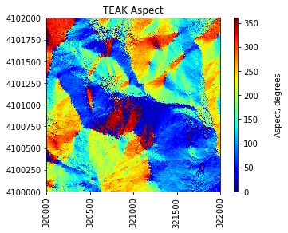

# Merging Geotif Tiles to Create a Mosaic


All of the lessons so far have been working with a single tile, but in your analysis you will likely want to work with a larger area of data, from a few tiles to an entire site. In this tutorial, we will demonstrate how to use the `gdal_merge` utility to mosaic multiple tiles together. This can be done in command line, or as a system command through `Python` as shown in this lesson. If you installed `Python` using `Anaconda`, you should have `gdal_merge.py` downloaded into your Anaconda folder, in a path similar to `C:\Users\user\AppData\Local\Continuum\Anaconda3\Scripts`. You can also download it here and save it to your working directory. For details on `gdal_merge` refer to http://www.gdal.org/gdal_merge.html. 

## Objectives

1. Merge multiple geotif raster tiles into a single mosaicked raster
2. Use the functions `raster2array` to read a tif raster into a Python array

We'll start by importing the packages `os` and `glob`:


```python
import os
import glob
```

Make a list of files to mosaic using `glob.glob`, and print the result. In this example, we are selecting all files ending with `_aspect.tif` in the folder `.\TEAK_Aspect_Tiles`:


```python
files_to_mosaic = glob.glob('.\TEAK_Aspect_Tiles\*_aspect.tif')
files_to_mosaic
```


    ['.\\TEAK_Aspect_Tiles\\NEON_D17_TEAK_DP3_320000_4100000_aspect.tif',
     '.\\TEAK_Aspect_Tiles\\NEON_D17_TEAK_DP3_320000_4101000_aspect.tif',
     '.\\TEAK_Aspect_Tiles\\NEON_D17_TEAK_DP3_321000_4100000_aspect.tif',
     '.\\TEAK_Aspect_Tiles\\NEON_D17_TEAK_DP3_321000_4101000_aspect.tif']


In order to run the `gdal_merge` function, we need these files as a series of strings. We can get them in the correct format using `join`:


```python
files_string = " ".join(files_to_mosaic)
print(files_string)
```

    .\TEAK_Aspect_Tiles\NEON_D17_TEAK_DP3_320000_4100000_aspect.tif .\TEAK_Aspect_Tiles\NEON_D17_TEAK_DP3_320000_4101000_aspect.tif .\TEAK_Aspect_Tiles\NEON_D17_TEAK_DP3_321000_4100000_aspect.tif .\TEAK_Aspect_Tiles\NEON_D17_TEAK_DP3_321000_4101000_aspect.tif
    

Now that we have the list of files we want to mosaic, we can run a system command to combine them into one raster. If `gdal_merge.py` is not copied into your working directory, you'll need to include the full path. 


```python
command = "python gdal_merge.py -o TEAK_Aspect_Mosaic.tif -of gtiff " + files_string
os.system(command)
```


    0


This creates the file `TEAK_Aspect_Mosaic.tif` in the working directory. Now we can use the function `raster2array` to read in the mosaiced array. This function converts the geotif file into an array, and also stores relevant metadata (eg. spatial information) into the dicitonary `metadata`. Load or import this function into your cell with `%load raster2array`.


```python
import numpy as np
from osgeo import gdal

def raster2array(geotif_file):
    metadata = {}
    dataset = gdal.Open(geotif_file)
    metadata['array_rows'] = dataset.RasterYSize
    metadata['array_cols'] = dataset.RasterXSize
    metadata['bands'] = dataset.RasterCount
    metadata['driver'] = dataset.GetDriver().LongName
    metadata['projection'] = dataset.GetProjection()
    metadata['geotransform'] = dataset.GetGeoTransform()
    
    mapinfo = dataset.GetGeoTransform()
    metadata['pixelWidth'] = mapinfo[1]
    metadata['pixelHeight'] = mapinfo[5]

    xMin = mapinfo[0]
    xMax = mapinfo[0] + dataset.RasterXSize/mapinfo[1]
    yMin = mapinfo[3] + dataset.RasterYSize/mapinfo[5]
    yMax = mapinfo[3]
    
    metadata['extent'] = (xMin,xMax,yMin,yMax)
    
    raster = dataset.GetRasterBand(1)
    array_shape = raster.ReadAsArray(0,0,metadata['array_cols'],metadata['array_rows']).astype(np.float).shape
    metadata['noDataValue'] = raster.GetNoDataValue()
    metadata['scaleFactor'] = raster.GetScale()
    
    array = np.zeros((array_shape[0],array_shape[1],dataset.RasterCount),'uint8') #pre-allocate stackedArray matrix
    
    if metadata['bands'] == 1:
        raster = dataset.GetRasterBand(1)
        metadata['noDataValue'] = raster.GetNoDataValue()
        metadata['scaleFactor'] = raster.GetScale()
              
        array = dataset.GetRasterBand(1).ReadAsArray(0,0,metadata['array_cols'],metadata['array_rows']).astype(np.float)
        #array[np.where(array==metadata['noDataValue'])]=np.nan
        array = array/metadata['scaleFactor']
    
    elif metadata['bands'] > 1:    
        for i in range(1, dataset.RasterCount+1):
            band = dataset.GetRasterBand(i).ReadAsArray(0,0,metadata['array_cols'],metadata['array_rows']).astype(np.float)
            #band[np.where(band==metadata['noDataValue'])]=np.nan
            band = band/metadata['scaleFactor']
            array[...,i-1] = band

    return array, metadata
```

We can call this function as follows, assuming `'TEAK_Aspect_Mosaic.tif'` is in your working directory:


```python
TEAK_aspect_array, TEAK_aspect_metadata = raster2array('TEAK_Aspect_Mosaic.tif')
```

Look at the size of the mosaicked tile using `.shape`. 


```python
TEAK_aspect_array.shape
```


    (2000, 2000)


Let's take a look at the contents of the metadata dictionary:


```python
#print metadata in alphabetical order
for item in sorted(TEAK_aspect_metadata):
    print(item + ':', TEAK_aspect_metadata[item])
```

    array_cols: 2000
    array_rows: 2000
    bands: 1
    driver: GeoTIFF
    extent: (320000.0, 322000.0, 4100000.0, 4102000.0)
    geotransform: (320000.0, 1.0, 0.0, 4102000.0, 0.0, -1.0)
    noDataValue: None
    pixelHeight: -1.0
    pixelWidth: 1.0
    projection: PROJCS["WGS 84 / UTM zone 11N",GEOGCS["WGS 84",DATUM["WGS_1984",SPHEROID["WGS 84",6378137,298.257223563,AUTHORITY["EPSG","7030"]],AUTHORITY["EPSG","6326"]],PRIMEM["Greenwich",0,AUTHORITY["EPSG","8901"]],UNIT["degree",0.0174532925199433,AUTHORITY["EPSG","9122"]],AUTHORITY["EPSG","4326"]],PROJECTION["Transverse_Mercator"],PARAMETER["latitude_of_origin",0],PARAMETER["central_meridian",-117],PARAMETER["scale_factor",0.9996],PARAMETER["false_easting",500000],PARAMETER["false_northing",0],UNIT["metre",1,AUTHORITY["EPSG","9001"]],AXIS["Easting",EAST],AXIS["Northing",NORTH],AUTHORITY["EPSG","32611"]]
    scaleFactor: 1.0
    

Load the function `plot_band_array` to plot the array:


```python
import matplotlib.pyplot as plt

def plot_array(array,refl_extent,colorlimit,ax=plt.gca(),title='',cmap_title='',colormap=''):
    plot = plt.imshow(array,extent=refl_extent,clim=colorlimit); 
    cbar = plt.colorbar(plot,aspect=40); plt.set_cmap(colormap); 
    cbar.set_label(cmap_title,rotation=90,labelpad=20);
    plt.title(title); ax = plt.gca(); 
    ax.ticklabel_format(useOffset=False, style='plain'); 
    rotatexlabels = plt.setp(ax.get_xticklabels(),rotation=90); 
```

Finally, let's take a look at the mosaicked data:


```python
plot_array(TEAK_aspect_array,
           TEAK_aspect_metadata['extent'],
           (0,360),
           title='TEAK Aspect',
           cmap_title='Aspect, degrees',
           colormap='jet')
```





## Exercises:

1. Use the function `raster2array` to read in and plot each tile separately. Confirm that the mosaicked raster looks reasonable. 
2. Download 9 adjacent tiles of another LiDAR L3 data product of your choice and use gdal_merge to combine them. You can find NEON data on the Data Portal -  http://data.neonscience.org/home, or Citrix. 
