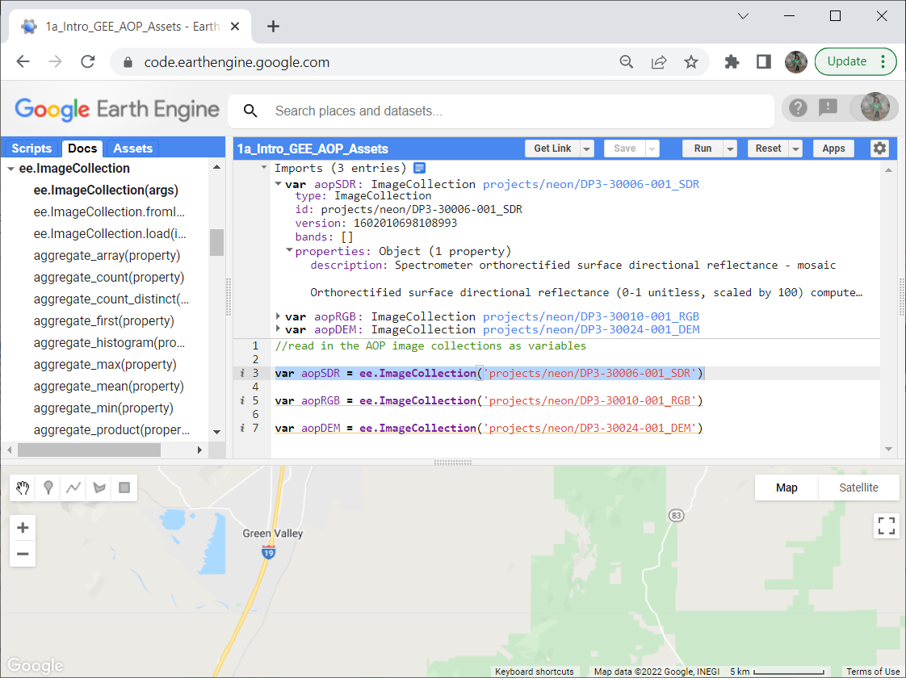
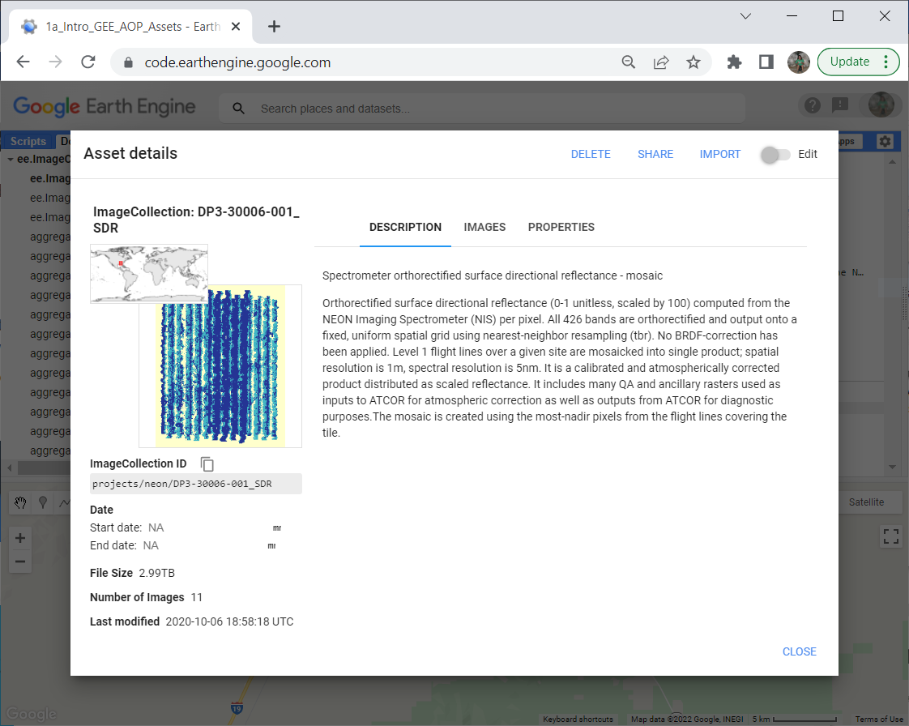
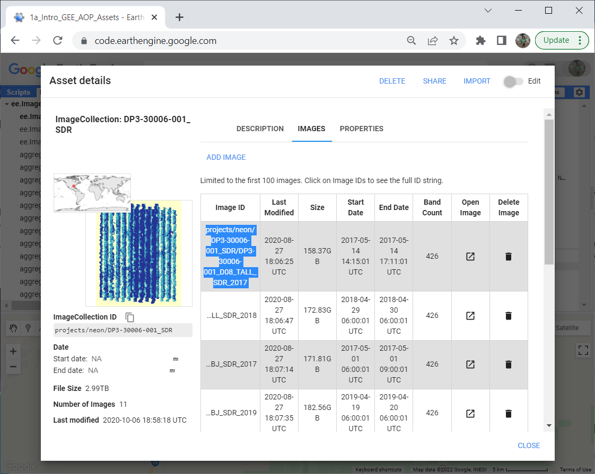

# AOP Data in Google Earth Engine (GEE) 101
### This lesson is the starting point for working with AOP data in GEE!

---

Author: Bridget Hass

Contributors: John Musinsky, Tristan Goulden, Lukas Straube

Last Updated: April 14, 2022

Objectives
---
- Introduce the Google Earth Engine (GEE) code editor 
- See which NEON AOP datasets are available in GEE
- Learn how to access the NEON AOP GEE datasets

Requirements
---
-	A gmail (@gmail.com) account
-	An Earth Engine account. You can sign up for an Earth Engine account here: https://earthengine.google.com/new_signup/
-	A basic understanding of the GEE code editor and the GEE JavaScript API. If you have never used GEE before, we recommend starting on the [google developers earth-engine page](https://developers.google.com/earth-engine/guides/getstarted) and working through some of the introductory tutorials.

Background
---
AOP has published a subset of AOP (L3) data products at 6 NEON sites (as of April 2022) on GEE. This data has been converted to Cloud Optimized Geotif (COG) format. NEON L3 lidar and derived spectral indices are avaialable in geotif raster format, so are relatively easy to add to GEE, however the hyperspectral data is available in hdf5 (hierarchical data format), and have been converted to the COG format prior to being added to GEE. 

To interactively explore NEON data available on GEE, you can use the [aop-data-visualization](https://neon-aop.users.earthengine.app/view/aop-data-visualization) app created by AOP Scientist John Musinsky. 

Data Availability & Access
---
The NEON data products that have been made available on GEE can be accessed through the `projects/neon` folder with an appended prefix of the Data Product ID, matching the [NEON data portal](https://data.neonscience.org/data-products/explore). The table below summarizes the prefixes to use for each data product. You will see how to access and read in these data products in the first part of this tutorial, so you may come back to this table if you wish to read in a different dataset.

| Acronym | Data Product      | Data Product ID (Prefix) |
|----------|------------|-------------------------|
| SDR | Surface Directional Reflectance | DP3-30006-001_SDR |
| RGB | Red Green Blue (Camera Imagery) | DP3-30010-001_RGB |
| DEM | Digital Surface and Terrain Models (DSM/DTM) | DP3-30024-001_DEM |
| CHM | Canopy Height Model | DP3-30015-001_CHM |*

The table below summarizes the sites, products, and years of NEON AOP data that can currently be accessed in GEE. The * indicates partial availability.

| Domain | Site | Years      | Data Products        |
|--------|------|------------|----------------------|
| D08 | TALL | 2017, 2018 | SDR, RGB, CHM, DSM, DTM |
| D11 | CLBJ | 2017, 2019 | SDR, RGB, CHM, DSM, DTM |
| D14 | JORN | 2017, 2019 | SDR, RGB*, DSM, DTM|
| D14 | SRER | 2017, 2018, 2019, 2021* | SDR, RGB, CHM*, DSM, DTM|
| D16 | WREF | 2017, 2018 | SDR, RGB, CHM, DSM, DTM |
| D17 | TEAK | 2017, 2018 | SDR, RGB, CHM, DSM, DTM |

Get Started with Google Earth Engine
---

Once you have set up your Google Earth Engine account you can navigate to the [earth engine code editor](https://code.earthengine.google.com/). The diagram below, from the [earth engine documentation](https://developers.google.com/earth-engine/guides/playground), shows the main components of the code editor. If you have used other programming languages such as R, Python, or Matlab, this should look fairly similar to other Integrated Development Environments (IDEs) you may have worked with. The main difference is that this has an interactive map at the bottom, similar to Google Maps / Google Earth. This editor is fairly intuitive; we encourage you to play around with the interactive map, or explore the ee documentation, linked above, to gain familiarity with the various features.


Read AOP Data Collections into GEE using `ee.ImageCollection`
---

AOP data can be accessed through GEE through the `projects/NEON` folder. In the remainder of this lesson, we will look at the three AOP datasets, or `ImageCollection`s in this folder.

An [ImageCollection](https://developers.google.com/earth-engine/guides/ic_creating) is a group of images. To find publicly available datasets (primarily satellite data), you can explore the Earth Engine [data catalog](https://developers.google.com/earth-engine/datasets). Currently, NEON AOP data in GEE cannot be discovered in the main data catalog, so the next steps will walk you through how you can find available AOP data.

In your code editor, copy and run the following lines of code to create 3 `ImageCollection` variables containing the Surface Directional Reflectance (SDR), Camera Imagery (RGB) and Digital Surface and Terrain Model (DEM) raster data sets. 

```javascript
//read in the AOP image collections as variables

var aopSDR = ee.ImageCollection('projects/neon/DP3-30006-001_SDR')

var aopRGB = ee.ImageCollection('projects/neon/DP3-30010-001_RGB') 

var aopDEM = ee.ImageCollection('projects/neon/DP3-30024-001_DEM')
```

A few notes on using the Code Editor: 
- In the left panel of the code editor, there is a **Docs** tab which includes API documentation on built in functions, showing the expected input arguments. We encourage you to refer to this documentation, as well as the [earth engine tutorials](https://developers.google.com/earth-engine/tutorials/tutorial_js_01) to familiarize yourself with GEE and the JavaScript language.
- If you have an error in your code, a red error message will show up in the Console (in the right panel), which tells you the line that failed.
- Save your code frequently! If you try to leave your code while it is unsaved, you will be prompted that there are unsaved changes in the editor.

When you Run the code above (by clicking on the **Run** above the code editor), you will notice that the lines of code are underlined in red, the same as you would see for a spelling error in most text editors. If you hover over each of the lines of codes, you will see a message pop up that says: `<variable> can be converted to an import record. Convert Ignore`. 


If you click `Convert`, the line of code will disappear and instead the variable will be pulled into the script directly, and will show up at the top of the code editor. Go ahead and do this for all three lines of code, so you should see the following. Tip: if you type Ctrl-z, you can re-generate the line of code, and the variable will still show up in the imported variables at the top of the editor. It is a good idea to retain the original code that reads in the variable, for reproducibility. If you don't do this, and wish to share this code with someone else, or run the code outside of your own code editor, the imported variables will not be saved.



Note that each of these imported variables can now be expanded, using the arrow to the left of each. These variables now show associated information including *type*, *id*, and *properties*, which if you expand, shows a *description*. This provides more detailed information about the data product.

Information about the image collections can also be found in a slightly more user-friendly format if you click on the blue `projects/neon/DP3-30006-001_SDR`, as well as `DP3-30010-001_RGB` and`DP3-30024-001_DEM`, respectively. Below we'll show the window that pops-up when you click on `SDR`, but we encourage you to look at all three datasets.



This allows you to read the full description in a more user-friendly format. Note that the images imported into GEE may have some slight differences from the data downloaded from the data portal. For example, note that the reflectance data in GEE is scaled by 100. We highly encourage you to explore the description and associated documentation for the data products on the NEON data portal as well (eg. [DP3.30006.001](https://data.neonscience.org/data-products/DP3.30006.001)) for relevant information about the data products, how they are generated, and other pertinent details.

You can also click on the `IMAGES` tab to explore all the available NEON images for that data product. Some of the text may be cut off in the default view, but if you click in one of the table values the table will expand. This table summarizes individual sites and years that are available for the SDR Image Collection. The ImageID provides the path to read in an individual image. In the next step, we will show how to use this path to pull in a single file. 



Read AOP Data into GEE using `ee.Image`
---

As a last step, we will go ahead and use the path specified in the SDR Asset Details Images table to read in a single image. Pulling in a single image uses almost identical syntax as an image collection, see below:

```javascript
var TALL_2017_SDR = ee.Image('projects/neon/DP3-30006-001_SDR/DP3-30006-001_D08_TALL_SDR_2017')
```

It doesn't look like we've done much so far, but already this is a great achievement! One of the barriers to working with AOP data, and reflectance data in particular, is it's large data volume, which in the past has required high-performance computers for carrying out any analysis. There are also limited open-source tools for working with the data, many of the software suites for working with hyperspectral require licenses which can be expensive. Here we have loaded an entire site of spectral data, and are ready for data exploration and analysis, in this free cloud-computing platform. In the next tutorials we will map the spectral data and carry out some more advanced analysis that is highly simplified by the built in GEE functions. 
