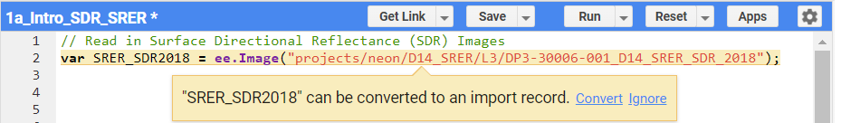
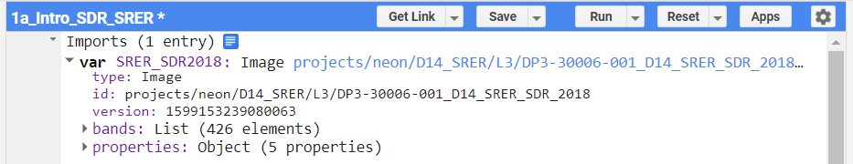
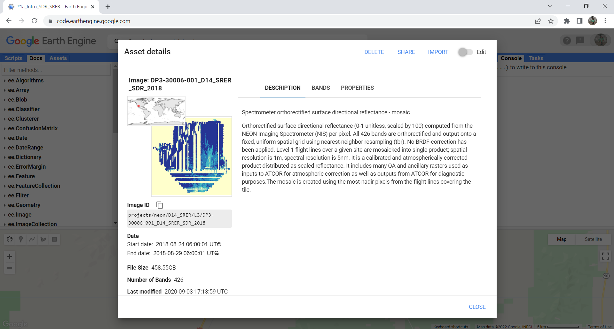
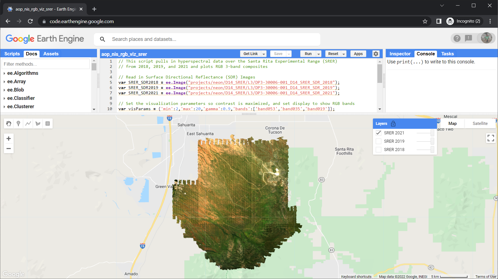
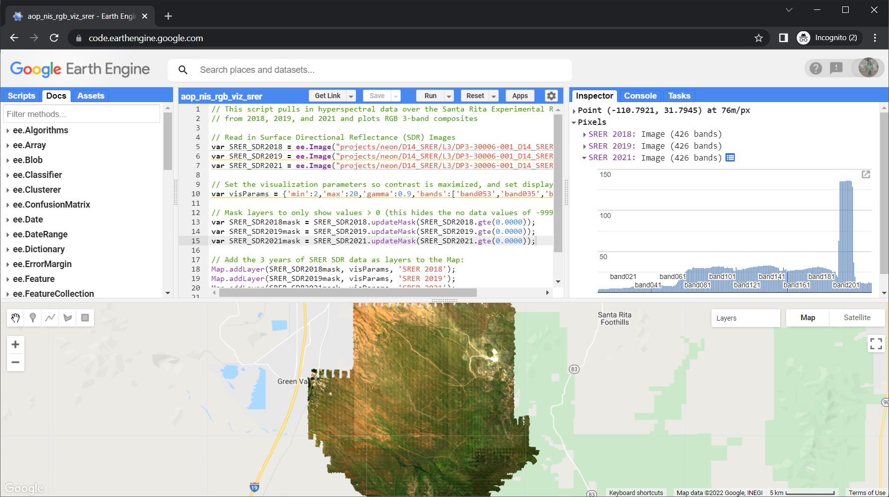

# Explore AOP Hyperspectral Data at the Santa Rita Experimental Range ([SRER](https://www.neonscience.org/field-sites/srer))

---

Author: Bridget Hass

Contributors: John Musinsky, Tristan Goulden, Lukas Straube

Last Updated: April 13, 2022

Objectives
---
- Introduce the Google Earth Engine (GEE) code editor 
- Read an AOP Hyperspectral Reflectance raster data set at the NEON site SRER
- Read in multiple years of data and explore inter-annual differences
- Explore GEE visualization and export options

Requirements
---
-	A gmail (@gmail.com) and Earth Engine account. You can sign up for an Earth Engine account here: https://earthengine.google.com/new_signup/
-	A basic understanding of the GEE code editor and the GEE JavaScript API. If you have never used GEE before, we recommend starting on the [google developers earth-engine page](https://developers.google.com/earth-engine/guides/getstarted) and working through some of the introductory tutorials.
-	An understanding of hyperspectral data and AOP spectral data products. If this is your first time working with AOP hyperspectral data, we encourage you to start with the [Intro to Working with Hyperspectral Remote Sensing Data](https://www.neonscience.org/resources/learning-hub/tutorials/hsi-hdf5-r) tutorial. You do not need to follow along with the code in those lessons, but at least read through to gain a better understanding NEON's spectral data products.

Background
---
AOP has published a subset of AOP (L3) data products at 6 NEON sites (as of April 2022) on GEE. This data has been converted to Cloud Optimized Geotif (COG) format. NEON L3 lidar and derived spectral indices are avaialable in geotif raster format, so are relatively easy to add to GEE, however the hyperspectral data is available in hdf5 (hierarchical data format), and have been converted to the COG format prior to being added to GEE. 

To interactively explore NEON data available on GEE, you can use the [aop-data-visualization](https://neon-aop.users.earthengine.app/view/aop-data-visualization) app created by AOP Scientist John Musinsky. 

Data Availability & Access
---
The NEON data products that have been made available on GEE can be accessed through the `projects/neon` folder with an appended prefix of the Data Product ID, matching the [NEON data portal](https://data.neonscience.org/data-products/explore). The table below summarizes the prefixes to use for each data product. You will see how to access and read in these data products in the first part of this tutorial, so you may come back to this table if you wish to read in a different dataset.

| Acronym | Data Product      | Data Product ID (Prefix) |
|----------|------------|-------------------------|
| SDR | Surface Directional Reflectance | DP3-30006-001_SDR |
| RGB | Red Green Blue (Camera Imagery) | DP3-30010-001_RGB |
| CHM | Canopy Height Model | DP3-30015-001_CHM |
| DSM | Digital Surface Model | DP3-30024-001_DSM |
| DTM | Digital Terrain Model | DP3-30024-001_DTM |

The table below summarizes the sites, products, and years of NEON AOP data that can currently be accessed in GEE. The * indicates partial availability.

| Domain/Site | Years      | Data Products        |
|----------|------------|-------------------------|
| D08 TALL | 2017, 2018 | SDR, RGB, CHM, DSM, DTM |
| D11 CLBJ | 2017, 2019 | SDR, RGB, CHM, DSM, DTM |
| D14 JORN | 2017, 2019 | SDR, RGB*, DSM, DTM|
| D14 SRER | 2017, 2018, 2019, 2021* | SDR, RGB, CHM*, DSM, DTM|
| D16 WREF | 2017, 2018 | SDR, RGB, CHM, DSM, DTM |
| D17 TEAK | 2017, 2018 | SDR, RGB, CHM, DSM, DTM |

Get Started with Google Earth Engine
---

Once you have set up your Google Earth Engine account you can navigate to the [earth engine code editor](https://code.earthengine.google.com/). The diagram below, from the [earth engine documentation](https://developers.google.com/earth-engine/guides/playground), shows the main components of the code editor. If you have used other programming languages such as R, Python, or Matlab, this should look fairly similar to other Integrated Development Environments (IDEs) you may have worked with. The main difference is that this has an interactive map at the bottom, similar to Google Maps / Google Earth. This editor is fairly intuitive; we encourage you to play around with the interactive map, or explore the ee documentation, linked above, to gain familiarity with the various features.


Read in and Visualize AOP Data
---
Now that you've gotten a sense for the Earth Engine code editor, we can pull in some AOP data! In this exercise, we will look at hyperspectral data over the Santa Rita Experimental Range collected in 3 years between 2018 and 2021.

We will work through a basic exercise consisting of the following steps:

1) Pull in an AOP hyperspectral data set
2) Set the visualization parameters
3) Mask the no data values
4) Add the AOP layer to the GEE Map
5) Center on the region of interest

We encourage you to follow along with this code chunks in this exercise in your code editor. To run the cells, you can click the **Run** button at the top of the code editor. Note that until the last two steps of this, you will not see the AOP data in the Interactive Map.

1) Read in the SRER 2018 SDR image, using `ee.Image`. We will assign this image to a variable (`var`) called `SRER_SDR2018`. You can refer to the tables in the Data Access and Availability section, above, to pull in spectral data from a different site.

```javascript
var SRER_SDR2018 = ee.Image("projects/neon/D14_SRER/L3/DP3-30006-001_D14_SRER_SDR_2018");
```

Note that when you type this code, it will be underlined in red (the same as you would see with a mis-spelled word). When you hover over this line, you will see an option pop up that says `"SRER_SDR2018" can be converted to an import record. Convert Ignore` 



If you click `Convert`, the line of code will disappear and the variable will be pulled into the top of the code editor, as shown below. Once imported, you can interactively explore this variable - eg. you can expand on the `bands` and `properties` to gain more information about this image, or "asset", as it's called in GEE.



Another way to learn more about this asset is to left-click on the blue `projects/neon/D14_SRER/L3_DP3-30006-001-D14_SRER_SDR_2018`. This will pop up a box with more detailed information about this asset, as shown below:



Click `Esc` to return to the code editor. Note that you can run the code either way, with the variable explicitly specified in the code editor, or imported as a variable, but we encourage you to leave the variable written out in the code, as this way is more reproducible.

2) Set the visualization parameters - this specifies the band combination that is displayed, and other display options. For more detailed information, refer to the GEE documentation on [image visualization](https://developers.google.com/earth-engine/guides/image_visualization).

To set the visualization parameters, we will create a new variable (called `visParams`). This variable is applied to the layer and determines what is displayed. In this we are setting the RGB bands to display - for this exercise we are setting them to red, green, and blue portions of the spectrum in order to show a True Color Image. You can change these bands to show a False Color Image or any band combination of interest. You can refer to NEON's lessons on [Multi-Band Rasters in R](https://www.neonscience.org/resources/learning-hub/tutorials/dc-multiband-rasters-r) or [RGB and False Color Images in Python](https://www.neonscience.org/resources/learning-hub/tutorials/neon-hsi-aop-functions-tiles-py) for more background on band stacking.

```javascript
var visParams = {'min':2,'max':20,'gamma':0.9,'bands':['band053','band035','band019']};
```

3) Mask layers to only show values > 0

This step is optional, but recommended. AOP sets No Data Values to -9999, so if you don't mask out these No Data Values you will see these No Data Values as black in the image. To show only the data that was collected, we recommend masking these values by creating a mask variable, using the `updateMask` function.

```javascript
var SRER_SDR2018mask = SRER_SDR2018.updateMask(SRER_SDR2021.gte(0.0000));
```

4) Now that we've defined the data, the visualization parameters, and the mask, we can add this Layer to the Map! To do this, we use the `Map.addLayer` function with our masked data variable, `SRER_SDRmask`, using the `visParams` and assign this layer a label, which will show up in the Map.

```javascript
Map.addLayer(SRER_SDR2018mask, visParams, 'SRER 2018');
```

5) Center the map on our area of interest. GEE by default does not know where we are interested in looking. We can center the map over our new data layer by 

```javascript
Map.setCenter(-110.83549, 31.91068, 11);
```

Putting it All Together
---
The following code chunk runs all the steps we just broke down, and also adds in 2 more years of data (2019 and 2021). You can access this code [here](https://code.earthengine.google.com/9b442fa13116b2ae487ac8a78d45ba69), or copy and paste the code below into your GEE code editor. Click **Run** to add the 3 SDR data layers for each year.

```javascript
// This script pulls in hyperspectral data over the Santa Rita Experimental Range (SRER)
// from 2018, 2019, and 2021 and plots RGB 3-band composites

// Read in Surface Directional Reflectance (SDR) Images 
var SRER_SDR2018 = ee.Image("projects/neon/D14_SRER/L3/DP3-30006-001_D14_SRER_SDR_2018");
var SRER_SDR2019 = ee.Image("projects/neon/D14_SRER/L3/DP3-30006-001_D14_SRER_SDR_2019");
var SRER_SDR2021 = ee.Image("projects/neon/D14_SRER/L3/DP3-30006-001_D14_SRER_SDR_2021");

// Set the visualization parameters so contrast is maximized, and set display to show RGB bands 
var visParams = {'min':2,'max':20,'gamma':0.9,'bands':['band053','band035','band019']};

// Mask layers to only show values > 0 (this hides the no data values of -9999) 
var SRER_SDR2018mask = SRER_SDR2018.updateMask(SRER_SDR2018.gte(0.0000));
var SRER_SDR2019mask = SRER_SDR2019.updateMask(SRER_SDR2019.gte(0.0000));
var SRER_SDR2021mask = SRER_SDR2021.updateMask(SRER_SDR2021.gte(0.0000));

// Add the 3 years of SRER SDR data as layers to the Map:
Map.addLayer(SRER_SDR2018mask, visParams, 'SRER 2018');
Map.addLayer(SRER_SDR2019mask, visParams, 'SRER 2019');
Map.addLayer(SRER_SDR2021mask, visParams, 'SRER 2021');

// Center the map on SRER & zoom to desired level
Map.setCenter(-110.83549, 31.91068, 11);
```

Once you have the three years of data added, you can look at the different years one at a time by selecting each layer in the Layers box inside the Map:



If you click anywhere inside the AOP map (where there is data), you will see the 426 spectral bands as a bar chart displayed for each of the layers in the Inspector window (top-right corner of the code editor). You can see the spectral values for different layers by clicking on the arrow to the left of the layer name (eg. SRER 2018). Note that these are just shown as band #s, and you can't tell from the chart what the wavelengths are. We will convert the band numbers to wavelengths in the next lesson!




