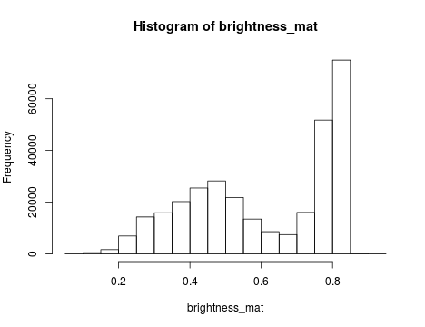

```r
library(hazer)
library(jpeg)
library(data.table)
```

This vignette explains how to 1) perform basic image processing and 2) estimate image haziness as an indication of fog, cloud or other natural or artificial factors using the `hazer`[^*] R package.


## Getting Started

Before I start the image processing steps, I demonstrate how to read and show an image.


```r
#read the path to the example image
jpeg_file <- system.file(package = 'hazer', 'pointreyes.jpg')

# read the image as an array
rgb_array <- jpeg::readJPEG(jpeg_file)

# plot the RGB array on the active device panel
par(mar=c(0,0,3,0))
plotRGBArray(rgb_array, bty = 'n', main = 'Point Reyes National Seashore')
```


#### Histogram of the RGB channels
Using the `stats::density` function, we can extract density distribution of each color channel.


```r
# color channels can be extracted from the matrix
red_vector <- rgb_array[,,1]
green_vector <- rgb_array[,,2]
blue_vector <- rgb_array[,,3]

# plotting 
par(mar=c(5,4,4,2))
plot(density(red_vector), col = 'red', lwd = 2, main = 'Density function of the RGB channels', ylim = c(0,5))
lines(density(green_vector), col = 'green', lwd = 2)
lines(density(blue_vector), col = 'blue', lwd = 2)
```


## Brightness, Darkness and Contrast

I show how to extract three basic elements of an RGB image using `hazer`:

1. Brightness
2. Darkness
3. Contrast


#### Brightness of an image
We can extract and show the brightness matrix using the `getBrightness` function

```r
#extracting the brightness matrix
brightness_mat <- getBrightness(rgb_array)

# unlike the RGB array which has 3 dimensions, the brithness matrix has only two 
# dimensions and can be shown as a grayscale image,
# we can do this using the same plotRGBArray function
par(mar=c(0,0,3,0))
plotRGBArray(brightness_mat, bty = 'n', main = 'Brightness matrix')

# each pixel in the brightness image is the maximum of the  R, G and B color channel

# to extract a single brighness value for the image, depending on our needs 
#  we can perform some statistics or we can just use the mean of this matrix

# the main quantiles
quantile(brightness_mat)
#>         0%        25%        50%        75%       100% 
#> 0.09019608 0.43529412 0.62745098 0.80000000 0.92549020

#  here, I can show the histogram
par(mar=c(5,4,4,2))
hist(brightness_mat)
```




#### Darkness of an image
Similarly, we can extract and show the darkness matrix using the `getDarkness` function

```r
#extracting the darkness matrix
darkness_mat <- getDarkness(rgb_array)

# the darkness matrix has also two dimensions and can be shown as a grayscale image
par(mar=c(0,0,3,0))
plotRGBArray(darkness_mat, bty = 'n', main = 'Darkness matrix')

# each pixel in the darkness image is the minimum of the  R, G and B color channel

# similarly, we can do some basic statistics

# the main quantiles
quantile(darkness_mat)
#>         0%        25%        50%        75%       100% 
#> 0.03921569 0.23137255 0.36470588 0.47843137 0.81568627

#  and the histogram
par(mar=c(5,4,4,2))
hist(darkness_mat)
```


#### Contrast of an image
The contrast of the image can quickly be extacted using the `getContrast` function.


```r
#extracting the contrast matrix
contrast_mat <- getContrast(rgb_array)

# the contrast matrix has also two dimensions and can be shown as a grayscale image
par(mar=c(0,0,3,0))

plotRGBArray(contrast_mat, bty = 'n', main = 'Contrast matrix')

# each pixel in the contrast image is the difference between the darkness and brightness matrices

# the main quantiles
quantile(contrast_mat)
#>        0%       25%       50%       75%      100% 
#> 0.0000000 0.1450980 0.2470588 0.3294118 0.4392157

#  and the histogram
par(mar=c(5,4,4,2))
hist(contrast_mat)
```


## Image fogginess and haziness
Haziness of an image can be estimated using the `getHazeFactor` function. This function is based on the method described in <a href="https://www.omicsonline.org/open-access/detecting-foggy-images-and-estimating-the-haze-degree-factor-jcsb.1000226.pdf">Mao et al. (2014)</a>. The technique was originally developed to for __"detecting foggy images and estimating the haze degree factor"__ for a wide range of outdoor conditions.

The function returns a vector of two numeric values: (1) haze as the haze degree and (2) A0 as the global atmospheric light, as it is explained in the original paper. For the PhenoCam standards, we classify any image with the haze degree greater than 0.4 as a significantly foggy image.


```r
#extracting the haze matrix
haze_degree <- getHazeFactor(rgb_array)

print(haze_degree)
#>      haze        A0 
#> 0.2247816 0.7129889
# note that the values might be slightly different due to rounding errors on different platforms
```


## Working with a set of images
We can use `for` loops or the `lapply` functions to extract the haze values for a stack of images. You can download the related datasets from <a href="http://bit.ly/2F8w2Ia">here</a>. Download and extract the zip file to be used as input data for the followig step.


```r

# set up the input image
# images_dir <- '/path/to/image/directory/'

# get a list of all .jpg files in the directory
pointreyes_images <- dir(path = images_dir, 
                         pattern = '*.jpg',
                         ignore.case = TRUE, 
                         full.names = TRUE)


## 1) using a for loop
# number of images
n <- length(pointreyes_images)

# an empty matrix to fill with haze and A0 values
haze_mat <- data.table()

pb <- txtProgressBar(0, n, style = 3)

for(i in 1:n) {
  image_path <- pointreyes_images[i]
  img <- jpeg::readJPEG(image_path)
  haze <- getHazeFactor(img)
  
  haze_mat <- rbind(haze_mat, 
                    data.table(file = image_path, 
                               haze = haze[1], 
                               A0 = haze[2]))
  
  setTxtProgressBar(pb, i)
}


haze_mat[haze>0.4,foggy:=TRUE]
haze_mat[haze<=0.4,foggy:=FALSE]

haze_mat

# move the foggy images to a new directory
foggy_dir <-   '/path/to/foggy/images/directory/'

file.copy(haze_mat[foggy==TRUE,file], to = foggy_dir)
file.remove(haze_mat[foggy==TRUE,file])

## 2) using the apply functions
# loading all the images as a list of arrays
img_list <- lapply(pointreyes_images, FUN = jpeg::readJPEG)

# getting the haze value for the list
haze_list <- t(sapply(img_list, FUN = getHazeFactor))

```


[^*]: The R package is developed and maintained by <a href="https://bnasr.github.io/">Bijan Seyednarollah</a>. Most recent release is available from: https://github.com/bnasr/hazer.

