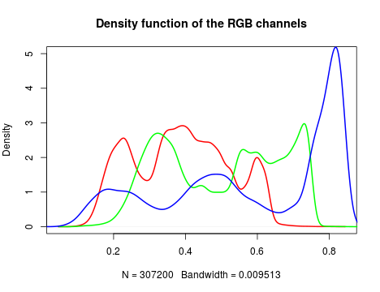
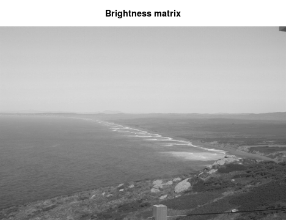
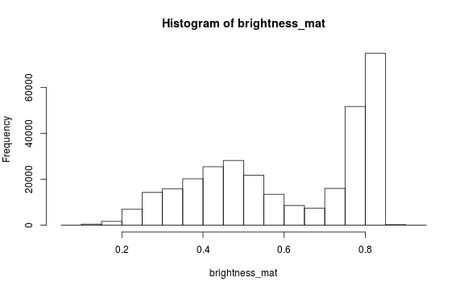
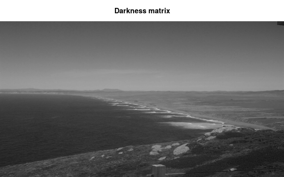
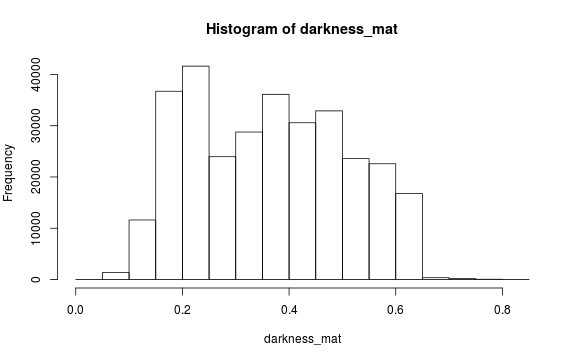
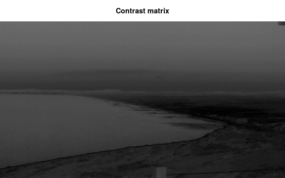
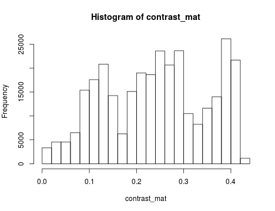

In this tutorial, you will learn how to 

1. perform basic image processing and 
2. estimate image haziness as an indication of fog, cloud or other natural or artificial factors using the `hazer`R package.


## Read & Plot Image

We will use several packages in this tutoiral. All are availale from CRAN.


```r

# load packages
library(hazer)
library(jpeg)
library(data.table)
```

Before we start the image processing steps, let's read in and plot an image. This
image is an example image that comes with the *hazer* package. 


```r
# read the path to the example image
jpeg_file <- system.file(package = 'hazer', 'pointreyes.jpg')

# read the image as an array
rgb_array <- jpeg::readJPEG(jpeg_file)

# plot the RGB array on the active device panel


# first set the margin in this order:(bottom, left, top, right)
par(mar=c(0,0,3,0))  
plotRGBArray(rgb_array, bty = 'n', main = 'Point Reyes National Seashore')
```


When we work with images, all data we work with is generally on the scale of each
individual pixel in the image. Therefore, for large images we will be working with
large matrixes that hold the value for each pixel. Keep this in mind before opening 
some of the matrices we'll be creating this tutorial as it can take a while for 
them to load. 

## Histogram of RGB channels

A histogram of the colors can be useful to understanding what our image is made
up of. Using the `density()` function from the base *stats* package, we can extract 
density distribution of each color channel.


```r

# color channels can be extracted from the matrix
red_vector <- rgb_array[,,1]
green_vector <- rgb_array[,,2]
blue_vector <- rgb_array[,,3]

# plotting 
par(mar=c(5,4,4,2)) 
plot(density(red_vector), col = 'red', lwd = 2, 
		 main = 'Density function of the RGB channels', ylim = c(0,5))
lines(density(green_vector), col = 'green', lwd = 2)
lines(density(blue_vector), col = 'blue', lwd = 2)
```



In *hazer* we can also extract three basic elements of an RGB image :

1. Brightness
2. Darkness
3. Contrast

## Brightness

The brightness matrix comes from the maximum value of the R, G, or B channel. We 
can extract and show the brightness matrix using the `getBrightness()` function. 


```r

# extracting the brightness matrix
brightness_mat <- getBrightness(rgb_array)

# unlike the RGB array which has 3 dimensions, the brightness matrix has only two 
# dimensions and can be shown as a grayscale image,
# we can do this using the same plotRGBArray function
par(mar=c(0,0,3,0))
plotRGBArray(brightness_mat, bty = 'n', main = 'Brightness matrix')
```



Here the grayscale is used to show the value of each pixel's maximum brightness 
of the R, G or B color channel. 

To extract a single brighness value for the image, depending on our needs we can 
perform some statistics or we can just use the mean of this matrix. 


```r
# the main quantiles
quantile(brightness_mat)
#>         0%        25%        50%        75%       100% 
#> 0.09019608 0.43529412 0.62745098 0.80000000 0.92549020

# create histogram
par(mar=c(5,4,4,2))
hist(brightness_mat)
```



Why are we getting so many images up in the high range of the brightness? Where
does this correlate to on the RGB image? 

## Darkness

Darkness is determined by the minimum of the R, G or B color channel. In the 
Similarly, we can extract and show the darkness matrix using the `getDarkness()` function.


```r

# extracting the darkness matrix
darkness_mat <- getDarkness(rgb_array)

# the darkness matrix has also two dimensions and can be shown as a grayscale image
par(mar=c(0,0,3,0))
plotRGBArray(darkness_mat, bty = 'n', main = 'Darkness matrix')

# main quantiles
quantile(darkness_mat)
#>         0%        25%        50%        75%       100% 
#> 0.03921569 0.23137255 0.36470588 0.47843137 0.81568627

# histogram
par(mar=c(5,4,4,2))
hist(darkness_mat)
```



## Contrast

The contrast of an image is the difference between the darkness and brightness 
of the image. The contrast matrix is calculated by difference between the 
darkness and brightness matrices. 

The contrast of the image can quickly be extacted using the `getContrast()` function.


```r

# extracting the contrast matrix
contrast_mat <- getContrast(rgb_array)

# the contrast matrix has also 2D and can be shown as a grayscale image
par(mar=c(0,0,3,0))
plotRGBArray(contrast_mat, bty = 'n', main = 'Contrast matrix')

# main quantiles
quantile(contrast_mat)
#>        0%       25%       50%       75%      100% 
#> 0.0000000 0.1450980 0.2470588 0.3294118 0.4392157

# histogram
par(mar=c(5,4,4,2))
hist(contrast_mat)
```




## Image fogginess & haziness

Haziness of an image can be estimated using the `getHazeFactor()` function. This 
function is based on the method described in 
<a href="https://www.omicsonline.org/open-access/detecting-foggy-images-and-estimating-the-haze-degree-factor-jcsb.1000226.pdf">Mao et al. (2014)</a>. 
The technique was originally developed to for *"detecting foggy images and 
estimating the haze degree factor"* for a wide range of outdoor conditions.

The function returns a vector of two numeric values: 

1.  **haze** as the haze degree and 
2.  **A0** as the global atmospheric light, as it is explained in the original paper. 

The PhenoCam standards classify any image with the haze degree greater 
than 0.4 as a significantly foggy image.


```r
# extracting the haze matrix
haze_degree <- getHazeFactor(rgb_array)

print(haze_degree)
#>      haze        A0 
#> 0.2247816 0.7129889
```

Here we have the haze values for our image. Note that the values might be 
slightly different due to rounding errors on different platforms. 

## Process sets of images

We can use `for` loops or the `lapply` functions to extract the haze values for 
a stack of images. 

You can download the related datasets from 
<a href="http://bit.ly/2F8w2Ia">here (direct download)</a>. 

Download and extract the zip file to be used as input data for the followig step.


```r

# set up the input image
#images_dir <- '/path/to/image/directory/'
images_dir <- "/Users/mjones01/Downloads/pointreyes"


# get a list of all .jpg files in the directory
pointreyes_images <- dir(path = images_dir, 
                         pattern = '*.jpg',
                         ignore.case = TRUE, 
                         full.names = TRUE)
```


Now we can use a for loop to process all of the images to get the haze and A0 
values. 


```r


# number of images
n <- length(pointreyes_images)

# create an empty matrix to fill with haze and A0 values
haze_mat <- data.table()

# the process takes a bit, a progress bar lets us know it is working.
pb <- txtProgressBar(0, n, style = 3)
#> Error in txtProgressBar(0, n, style = 3): must have 'max' > 'min'

for(i in 1:n) {
  image_path <- pointreyes_images[i]
  img <- jpeg::readJPEG(image_path)
  haze <- getHazeFactor(img)
  
  haze_mat <- rbind(haze_mat, 
                    data.table(file = image_path, 
                               haze = haze[1], 
                               A0 = haze[2]))
  
  setTxtProgressBar(pb, i)
}
#> Error in jpeg::readJPEG(image_path): unable to open NA
```

Now we have a matrix with haze and A0 values for all our images. Let's classify
those into hazy and non-hazy as per the PhenoCam standard of 0.4. 


```r

# classify image as hazy: T/F
haze_mat[haze>0.4,foggy:=TRUE]
#> Error in .checkTypos(e, names(x)): Object 'haze' not found amongst
haze_mat[haze<=0.4,foggy:=FALSE]
#> Error in .checkTypos(e, names(x)): Object 'haze' not found amongst

head(haze_mat)
#> Null data.table (0 rows and 0 cols)
```

Now we can save all the foggy images to a new folder that will retain the
foggy images but keep them seperate from the non-foggy ones that we want to 
analyze. 


```r

# identify directory to move the foggy images to
#foggy_dir <- '/path/to/foggy/images/directory/'
foggy_dir <- "/Users/mjones01/Downloads/pointreyes-foggy"

# if a new directory, create new directory at this file path
#dir.create(foggy_dir)

# copy the files to the new directory
file.copy(haze_mat[foggy==TRUE,file], to = foggy_dir)
#> Error in .checkTypos(e, names(x)): Object 'foggy' not found amongst

# remove the files from the old directory
file.remove(haze_mat[foggy==TRUE,file])
#> Error in .checkTypos(e, names(x)): Object 'foggy' not found amongst
```

Now that we have our images seperated, we can get the full list of haze
values only for those images that are not classfied as "foggy".  


```r

# loading all the images as a list of arrays
img_list <- lapply(pointreyes_images, FUN = jpeg::readJPEG)

# getting the haze value for the list
# patience - this takes a bit of time
haze_list <- t(sapply(img_list, FUN = getHazeFactor))

# view first few entries
head(haze_list)
#>     
#> [1,]
```

We can then use these values for further analyses and data correction. 

*** 

The *hazer* R package is developed and maintained by 
<a href="https://bnasr.github.io/">Bijan Seyednarollah</a>. 
The most recent release is available from 
<a href="https://github.com/bnasr/hazer" target="_blank">https://github.com/bnasr/hazer</a>.
