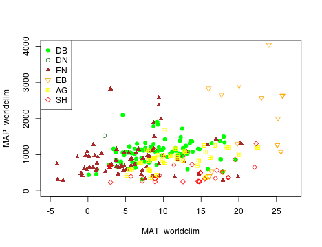
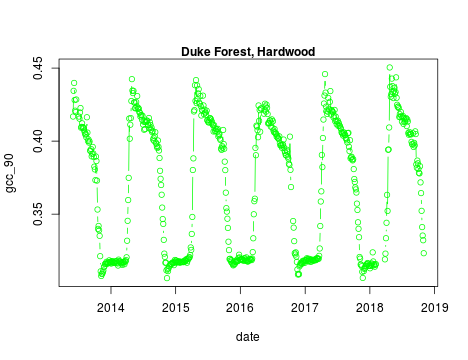

The `phenocamapi`[^*] R package is developed to simplify interacting with the PhenoCam dataset and perform data wrangling steps on sites' data and metaadata.

Each PhenoCam site has specific metadata including but not limited to how a site is set up and where it is located, what vegetation type is visible from the camera, and its climate regime. Each PhenoCam may have none to several ROI's per vegetation type. `phenocamapi` is an interface to interact with the PhenoCam server to extract those data and process them in an R environment.


I begin with several examples for extracting PhenoCam data directly from the server:

- Exploring the PhenoCam metadata
- Filtering the dataset by site attributes
- Downloading PhenoCam time-series data
- Extracting the list of midday images
- Downloading midday images for a given time range
 
## Exploring the PhenoCam metadata
We can obtain an up-to-date `data.frame` of the metadata of the entire PhenoCam network using the `get_phenos()` function. The returning value would be a `data.table` in order to simplify further data exploration.


```r

# obtaining the phenocam site metadata from the server as data.table
phenos <- get_phenos()

# checking out the first few sites
head(phenos$site)
#> [1] "acadia"         "aguatibiaeast"  "aguatibianorth" "ahwahnee"      
#> [5] "alleypond"      "alligatorriver"

# checking out the columns
colnames(phenos)
#>  [1] "site"                      "lat"                      
#>  [3] "lon"                       "elev"                     
#>  [5] "active"                    "utc_offset"               
#>  [7] "date_first"                "date_last"                
#>  [9] "site_description"          "camera_description"       
#> [11] "camera_orientation"        "flux_data"                
#> [13] "flux_networks"             "flux_sitenames"           
#> [15] "dominant_species"          "primary_veg_type"         
#> [17] "secondary_veg_type"        "site_meteorology"         
#> [19] "MAT_site"                  "MAP_site"                 
#> [21] "MAT_daymet"                "MAP_daymet"               
#> [23] "MAT_worldclim"             "MAP_worldclim"            
#> [25] "koeppen_geiger"            "ecoregion"                
#> [27] "landcover_igbp"            "flux_networks_name"       
#> [29] "flux_networks_url"         "flux_networks_description"

# removing the sites with unkown MAT and MAP values
phenos <- phenos[!((MAT_worldclim == -9999)|(MAP_worldclim == -9999))]

# extracting the PhenoCam climate space based on the WorldClim dataset
# and plotting the sites across the climate space different vegetation type as different symbols and colors
phenos[primary_veg_type=='DB', plot(MAT_worldclim, MAP_worldclim, pch = 19, col = 'green', xlim = c(-5, 27), ylim = c(0, 4000))]
#> NULL
phenos[primary_veg_type=='DN', points(MAT_worldclim, MAP_worldclim, pch = 1, col = 'darkgreen')]
#> NULL
phenos[primary_veg_type=='EN', points(MAT_worldclim, MAP_worldclim, pch = 17, col = 'brown')]
#> NULL
phenos[primary_veg_type=='EB', points(MAT_worldclim, MAP_worldclim, pch = 25, col = 'orange')]
#> NULL
phenos[primary_veg_type=='AG', points(MAT_worldclim, MAP_worldclim, pch = 12, col = 'yellow')]
#> NULL
phenos[primary_veg_type=='SH', points(MAT_worldclim, MAP_worldclim, pch = 23, col = 'red')]
#> NULL
legend('topleft', legend = c('DB','DN', 'EN','EB','AG', 'SH'), 
       pch = c(19, 1, 17, 25, 12, 23), 
       col =  c('green', 'darkgreen', 'brown',  'orange',  'yellow',  'red' ))
```




## Filtering the dataset using attributes
For example we can just list the sites that have flux tower:


```r
# store sites with flux_data available
phenofluxsites <- phenos[flux_data==TRUE&!is.na(flux_sitenames), .(PhenoCam=site, Flux=flux_sitenames)]

# see the first few rows
head(phenofluxsites)
#>                PhenoCam   Flux
#> 1:       alligatorriver US-NC4
#> 2:        arscolesnorth   LTAR
#> 3:        arscolessouth   LTAR
#> 4: arsgreatbasinltar098 US-Rws
#> 5:          arsope3ltar       
#> 6:           austincary US-SP1

#list deciduous broadleaf sites with flux tower
DB.flux <- phenos[flux_data==TRUE&primary_veg_type=='DB', site]

# see the first few rows
head(DB.flux)
#> [1] "alligatorriver" "bartlett"       "bartlettir"     "bbc3"          
#> [5] "bbc4"           "bbc7"
```


## Downloading PhenoCam time-series data
PhenoCam time-series are extracted time-series data obtained from ROI's for a given site. 

To download the phenological time-series from the PhenoCam, we need to know the sitename, vegetation type and ROI ID. This information can be obtained from the <a href="https://phenocam.sr.unh.edu/webcam/">PhenoCam website</a> or using the `get_rois()` function:


```r
# obtaining the list of all the available ROI's on the PhenoCam server
rois <- get_rois()

head(rois$roi_name)
#> [1] "alligatorriver_DB_1000"   "arbutuslake_DB_1000"     
#> [3] "arbutuslakeinlet_DB_1000" "arbutuslakeinlet_EN_1000"
#> [5] "arbutuslakeinlet_EN_2000" "archboldavir_AG_1000"

colnames(rois)
#>  [1] "roi_name"          "site"              "lat"              
#>  [4] "lon"               "roitype"           "sequence_number"  
#>  [7] "description"       "first_date"        "last_date"        
#> [10] "site_years"        "missing_data_pct"  "roi_page"         
#> [13] "roi_stats_file"    "one_day_summary"   "three_day_summary"
#> [16] "data_release"

# list all the ROI's for dukehw
rois[site=='dukehw',]
#>          roi_name   site      lat       lon roitype sequence_number
#> 1: dukehw_DB_1000 dukehw 35.97358 -79.10037      DB            1000
#>                                      description first_date  last_date
#> 1: canopy level DB forest at awesome Duke forest 2013-06-01 2018-11-01
#>    site_years missing_data_pct
#> 1:        5.2              4.0
#>                                                                   roi_page
#> 1: https://phenocam.sr.unh.edu/data/archive/dukehw/ROI/dukehw_DB_1000.html
#>                                                                     roi_stats_file
#> 1: https://phenocam.sr.unh.edu/data/archive/dukehw/ROI/dukehw_DB_1000_roistats.csv
#>                                                                one_day_summary
#> 1: https://phenocam.sr.unh.edu/data/archive/dukehw/ROI/dukehw_DB_1000_1day.csv
#>                                                              three_day_summary
#> 1: https://phenocam.sr.unh.edu/data/archive/dukehw/ROI/dukehw_DB_1000_3day.csv
#>    data_release
#> 1:          pre
```


The `get_pheno_ts()` function can download a time-series and return the result as a `data.table`. For example, to obtain the time-series for <a href="https://phenocam.sr.unh.edu/data/archive/dukehw/ROI/dukehw_DB_1000.html">DB_1000</a> from the **dukehw** PhenoCam site, we can run the following code:


```r
# to obtain the DB 1000  from dukehw
dukehw_DB_1000 <- get_pheno_ts(site = 'dukehw', vegType = 'DB', roiID = 1000, type = '3day')

colnames(dukehw_DB_1000)
#>  [1] "date"                 "year"                 "doy"                 
#>  [4] "image_count"          "midday_filename"      "midday_r"            
#>  [7] "midday_g"             "midday_b"             "midday_gcc"          
#> [10] "midday_rcc"           "r_mean"               "r_std"               
#> [13] "g_mean"               "g_std"                "b_mean"              
#> [16] "b_std"                "gcc_mean"             "gcc_std"             
#> [19] "gcc_50"               "gcc_75"               "gcc_90"              
#> [22] "rcc_mean"             "rcc_std"              "rcc_50"              
#> [25] "rcc_75"               "rcc_90"               "max_solar_elev"      
#> [28] "snow_flag"            "outlierflag_gcc_mean" "outlierflag_gcc_50"  
#> [31] "outlierflag_gcc_75"   "outlierflag_gcc_90"   "YEAR"                
#> [34] "DOY"                  "YYYYMMDD"

dukehw_DB_1000[,date:=as.Date(date)]
dukehw_DB_1000[,plot(date, gcc_90, col = 'green', type = 'b')]
#> NULL
mtext('Duke Forest, Hardwood', font = 2)
```




## Extracting the list of midday images
While PhenoCam sites may have many images in a given day, a list of midday images (only one image a day) can be useful for simple analyses.

```r
# obtaining midday_images for dukehw
duke_middays <- get_midday_list('dukehw', direct = FALSE)

# see the first few rows
head(duke_middays)
#> [1] "http://phenocam.sr.unh.edu/data/archive/dukehw/2013/05/dukehw_2013_05_31_150331.jpg"
#> [2] "http://phenocam.sr.unh.edu/data/archive/dukehw/2013/06/dukehw_2013_06_01_120111.jpg"
#> [3] "http://phenocam.sr.unh.edu/data/archive/dukehw/2013/06/dukehw_2013_06_02_120109.jpg"
#> [4] "http://phenocam.sr.unh.edu/data/archive/dukehw/2013/06/dukehw_2013_06_03_120110.jpg"
#> [5] "http://phenocam.sr.unh.edu/data/archive/dukehw/2013/06/dukehw_2013_06_04_120119.jpg"
#> [6] "http://phenocam.sr.unh.edu/data/archive/dukehw/2013/06/dukehw_2013_06_05_120110.jpg"

# download a file
destfile <- tempfile(fileext = '.jpg')
download.file(duke_middays[1], destfile = destfile)

img <- try(readJPEG(destfile))
if(class(img)!='try-error'){
  par(mar= c(0,0,0,0))
  plot(0:1,0:1, type='n', axes= FALSE, xlab= '', ylab = '')
  rasterImage(img, 0, 0, 1, 1)
}
```


## Downloading midday images for a given time range

```r

# download a subset
download_dir <- download_midday_images(site = 'dukehw', y = 2018, months = 4, download_dir = tempdir())

# list of downloaded files
duke_middays_path <- dir(download_dir, pattern = 'dukehw*', full.names = TRUE)

head(duke_middays_path)

```

While the purpose of this document is to show the basic commands for interacting with the PhenoCam API. More vignettes can be found in the package on how to merge external time-series (e.g. Flux data) with the PhenoCam time-series. 

[^*]: The R package is developed and maintained by <a href="https://bnasr.github.io/">Bijan Seyednarollah</a>. Most recent release is available from: https://github.com/bnasr/xROI.


