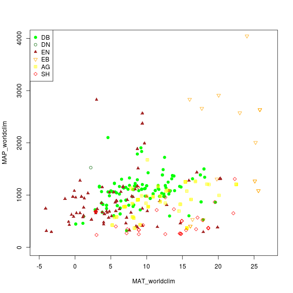
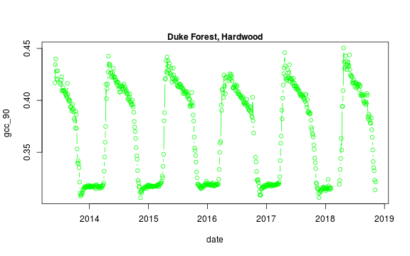
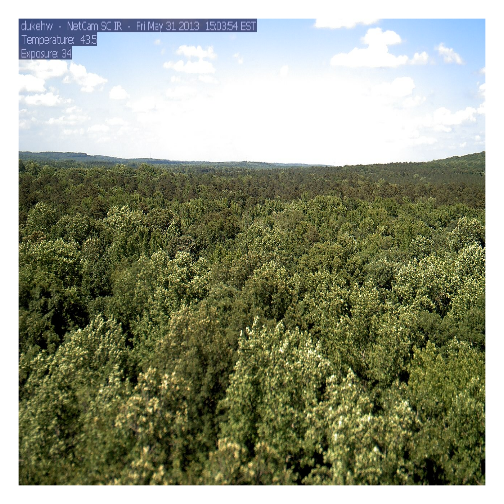
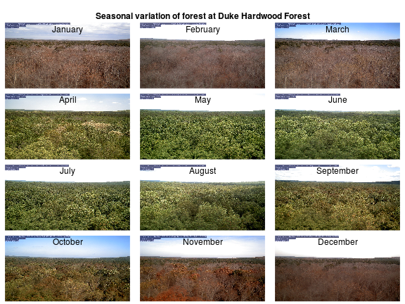

The <a href="https://cran.r-project.org/web/packages/phenocamapi/index.html" target="_blank"> *phenocamapi* R package</a> 
is developed to simplify interacting with the 
<a href="https://phenocam.sr.unh.edu" target="_blank">PhenoCam network</a> 
dataset and perform data wrangling steps on PhenoCam sites' data and metaadata.

This tutorial will show you the basic commands for accessing PhenoCam data
through the PhenoCam API. The *phenocampapi* R package is developed and maintained by 
<a href="https://bnasr.github.io/" target="_blank">Bijan Seyednarollah</a>. 
The most recent release is available on GitHub (<a href="https://github.com/bnasr/phenocamapi" target="_blank">PhenocamAPI</a>). 
<a href="https://github.com/bnasr/phenocamapi/tree/master/vignettes" target ="_blank">Additional vignettes</a> 
can be found on how to merge external time-series (e.g. Flux data) with the 
PhenoCam time-series. 

We begin with several useful skills and tools for extracting PhenoCam data 
directly from the server:

- Exploring the PhenoCam metadata
- Filtering the dataset by site attributes
- Downloading PhenoCam time-series data
- Extracting the list of midday images
- Downloading midday images for a given time range

## Exploring PhenoCam metadata

Each PhenoCam site has specific metadata including but not limited to how a site 
is set up and where it is located, what vegetation type is visible from the 
camera, and its climate regime. Each PhenoCam may have zero to several Regions 
of Interest (ROIs) per vegetation type. The *phenocamapi* package is an 
interface to interact with the PhenoCam server to extract those data and 
process them in an R environment.

To explore the PhenoCam data, we'll use several packages for this tutorial. 


```r

library(data.table)
library(phenocamapi)
library(lubridate)
library(jpeg)
```


We can obtain an up-to-date `data.frame` of the metadata of the entire PhenoCam 
network using the `get_phenos()` function. The returning value would be a 
`data.table` in order to simplify further data exploration.


```r

# obtaining the phenocam site metadata from the server as data.table
phenos <- get_phenos()

# checking out the first few sites
head(phenos$site)
#> [1] "acadia"         "aguatibiaeast"  "aguatibianorth" "ahwahnee"      
#> [5] "alleypond"      "alligatorriver"

# checking out the columns
colnames(phenos)
#>  [1] "site"                      "lat"                      
#>  [3] "lon"                       "elev"                     
#>  [5] "active"                    "utc_offset"               
#>  [7] "date_first"                "date_last"                
#>  [9] "site_description"          "camera_description"       
#> [11] "camera_orientation"        "flux_data"                
#> [13] "flux_networks"             "flux_sitenames"           
#> [15] "dominant_species"          "primary_veg_type"         
#> [17] "secondary_veg_type"        "site_meteorology"         
#> [19] "MAT_site"                  "MAP_site"                 
#> [21] "MAT_daymet"                "MAP_daymet"               
#> [23] "MAT_worldclim"             "MAP_worldclim"            
#> [25] "koeppen_geiger"            "ecoregion"                
#> [27] "landcover_igbp"            "flux_networks_name"       
#> [29] "flux_networks_url"         "flux_networks_description"
```

Now we have a better idea of the types of metadata that are available for the
Phenocams. 

### Remove null values

We may want to explore some of the patterns in the metadata before we jump into
specific locations. 

Let's look at Mean Annual Precipiation (MAP) and Mean Annual
Temperature (MAT) across the differnet field site and classify those by the
primary vegetation type (`primary_veg_type`) for each site. We can find out what the abbreviations
for the vegetation types mean from the following table:

| Abbreviation |	Description |
|----------|:-------------:|------:|
| AG |	agriculture |
| DB |	deciduous broadleaf |
| DN |	deciduous needleleaf |
| EB |	evergreen broadleaf |
| EN |	evergreen needleleaf |
| GR |	grassland |
| MX |	mixed vegetation (generally EN/DN, DB/EN, or DB/EB) |
| SH |	shrubs |
| TN |	tundra (includes sedges, lichens, mosses, etc.) |
| WT |	wetland |
| NV |	non-vegetated |
| RF |	reference panel | 	 
| XX |	unspecified |

To do this we'd first want to remove the sites where there is not data and then 
plot the data. 


```r
# removing the sites with unkown MAT and MAP values
phenos <- phenos[!((MAT_worldclim == -9999)|(MAP_worldclim == -9999))]

# extracting the PhenoCam climate space based on the WorldClim dataset
# and plotting the sites across the climate space different vegetation type as different symbols and colors
phenos[primary_veg_type=='DB', plot(MAT_worldclim, MAP_worldclim, pch = 19, col = 'green', xlim = c(-5, 27), ylim = c(0, 4000))]
#> NULL
phenos[primary_veg_type=='DN', points(MAT_worldclim, MAP_worldclim, pch = 1, col = 'darkgreen')]
#> NULL
phenos[primary_veg_type=='EN', points(MAT_worldclim, MAP_worldclim, pch = 17, col = 'brown')]
#> NULL
phenos[primary_veg_type=='EB', points(MAT_worldclim, MAP_worldclim, pch = 25, col = 'orange')]
#> NULL
phenos[primary_veg_type=='AG', points(MAT_worldclim, MAP_worldclim, pch = 12, col = 'yellow')]
#> NULL
phenos[primary_veg_type=='SH', points(MAT_worldclim, MAP_worldclim, pch = 23, col = 'red')]
#> NULL

legend('topleft', legend = c('DB','DN', 'EN','EB','AG', 'SH'), 
       pch = c(19, 1, 17, 25, 12, 23), 
       col =  c('green', 'darkgreen', 'brown',  'orange',  'yellow',  'red' ))
```




### Filtering using attributes

Alternatively, we may want to only include Phenocams with certain attributes in
our datasets. For example, we may be interested only in sites with a co-located
flux tower. For this, we'd want to filter for those with a flux tower using the
`flux_sitenames` attribute in the metadata. 


```r
# store sites with flux_data available and the FLUX site name is specified
phenofluxsites <- phenos[flux_data==TRUE&!is.na(flux_sitenames)&flux_sitenames!='', 
                         .(PhenoCam=site, Flux=flux_sitenames)] # return as table 
#and specify which variables to retain

phenofluxsites <- phenofluxsites[Flux!='']

# see the first few rows
head(phenofluxsites)
#>                PhenoCam   Flux
#> 1:       alligatorriver US-NC4
#> 2:        arscolesnorth   LTAR
#> 3:        arscolessouth   LTAR
#> 4: arsgreatbasinltar098 US-Rws
#> 5:           austincary US-SP1
#> 6:        barrocolorado PA-Bar
```

We could further identify which of those Phenocams with a fluxtower and in 
decidious broadleaf forests (`primary_veg_type=='DB'`). 


```r

#list deciduous broadleaf sites with flux tower
DB.flux <- phenos[flux_data==TRUE&primary_veg_type=='DB', 
                  site]  # return just the site names as a list

# see the first few rows
head(DB.flux)
#> [1] "alligatorriver" "bartlett"       "bartlettir"     "bbc3"          
#> [5] "bbc4"           "bbc7"
```


## PhenoCam time series

PhenoCam time series are extracted time series data obtained from ROI's for a 
given site. 

### Obtain ROIs
To download the phenological time series from the PhenoCam, we need to know the 
sitename, vegetation type and ROI ID. This information can be obtained from each
specific PhenoCam page on the 
<a href="https://phenocam.sr.unh.edu/webcam/gallery/" target="_blank">PhenoCam website</a> 
or by using the `get_rois()` function. 


```r
# obtaining the list of all the available ROI's on the PhenoCam server
rois <- get_rois()

# view what information is returned
colnames(rois)
#>  [1] "roi_name"          "site"              "lat"              
#>  [4] "lon"               "roitype"           "sequence_number"  
#>  [7] "description"       "first_date"        "last_date"        
#> [10] "site_years"        "missing_data_pct"  "roi_page"         
#> [13] "roi_stats_file"    "one_day_summary"   "three_day_summary"
#> [16] "data_release"

# view first few locations
head(rois$roi_name)
#> [1] "alligatorriver_DB_1000"   "arbutuslake_DB_1000"     
#> [3] "arbutuslakeinlet_DB_1000" "arbutuslakeinlet_EN_1000"
#> [5] "arbutuslakeinlet_EN_2000" "archboldavir_AG_1000"
```

### Download time series

The `get_pheno_ts()` function can download a time series and return the result 
as a `data.table`. 
Let's work with the 
<a href="https://phenocam.sr.unh.edu/data/archive/dukehw/ROI/dukehw_DB_1000.html">Duke Forest Hardwood Stand (`dukehw`) PhenoCam</a> 
and specifically the ROI 
<a href="https://phenocam.sr.unh.edu/data/archive/dukehw/ROI/dukehw_DB_1000.html">`DB_1000`</a> 
we can run the following code. 


```r
# list ROIs for dukehw
rois[site=='dukehw',]
#>          roi_name   site      lat       lon roitype sequence_number
#> 1: dukehw_DB_1000 dukehw 35.97358 -79.10037      DB            1000
#>                                      description first_date  last_date
#> 1: canopy level DB forest at awesome Duke forest 2013-06-01 2018-11-07
#>    site_years missing_data_pct
#> 1:        5.2              4.0
#>                                                                   roi_page
#> 1: https://phenocam.sr.unh.edu/data/archive/dukehw/ROI/dukehw_DB_1000.html
#>                                                                     roi_stats_file
#> 1: https://phenocam.sr.unh.edu/data/archive/dukehw/ROI/dukehw_DB_1000_roistats.csv
#>                                                                one_day_summary
#> 1: https://phenocam.sr.unh.edu/data/archive/dukehw/ROI/dukehw_DB_1000_1day.csv
#>                                                              three_day_summary
#> 1: https://phenocam.sr.unh.edu/data/archive/dukehw/ROI/dukehw_DB_1000_3day.csv
#>    data_release
#> 1:          pre

# to obtain the DB 1000 from dukehw
dukehw_DB_1000 <- get_pheno_ts(site = 'dukehw', vegType = 'DB', roiID = 1000, type = '3day')

# what data are available
str(dukehw_DB_1000)
#> Classes 'data.table' and 'data.frame':	664 obs. of  35 variables:
#>  $ date                : Factor w/ 664 levels "2013-06-01","2013-06-04",..: 1 2 3 4 5 6 7 8 9 10 ...
#>  $ year                : int  2013 2013 2013 2013 2013 2013 2013 2013 2013 2013 ...
#>  $ doy                 : int  152 155 158 161 164 167 170 173 176 179 ...
#>  $ image_count         : int  57 76 77 77 77 78 21 0 0 0 ...
#>  $ midday_filename     : Factor w/ 636 levels "dukehw_2013_06_01_120111.jpg",..: 1 2 3 4 5 6 7 636 636 636 ...
#>  $ midday_r            : num  91.3 76.4 60.6 76.5 88.9 ...
#>  $ midday_g            : num  97.9 85 73.2 82.2 95.7 ...
#>  $ midday_b            : num  47.4 33.6 35.6 37.1 51.4 ...
#>  $ midday_gcc          : num  0.414 0.436 0.432 0.42 0.406 ...
#>  $ midday_rcc          : num  0.386 0.392 0.358 0.391 0.377 ...
#>  $ r_mean              : num  87.6 79.9 72.7 80.9 83.8 ...
#>  $ r_std               : num  5.9 6 9.5 8.23 5.89 ...
#>  $ g_mean              : num  92.1 86.9 84 88 89.7 ...
#>  $ g_std               : num  6.34 5.26 7.71 7.77 6.47 ...
#>  $ b_mean              : num  46.1 38 39.6 43.1 46.7 ...
#>  $ b_std               : num  4.48 3.42 5.29 4.73 4.01 ...
#>  $ gcc_mean            : num  0.408 0.425 0.429 0.415 0.407 ...
#>  $ gcc_std             : num  0.00859 0.0089 0.01318 0.01243 0.01072 ...
#>  $ gcc_50              : num  0.408 0.427 0.431 0.416 0.407 ...
#>  $ gcc_75              : num  0.414 0.431 0.435 0.424 0.415 ...
#>  $ gcc_90              : num  0.417 0.434 0.44 0.428 0.421 ...
#>  $ rcc_mean            : num  0.388 0.39 0.37 0.381 0.38 ...
#>  $ rcc_std             : num  0.01176 0.01032 0.01326 0.00881 0.00995 ...
#>  $ rcc_50              : num  0.387 0.391 0.373 0.383 0.382 ...
#>  $ rcc_75              : num  0.391 0.396 0.378 0.388 0.385 ...
#>  $ rcc_90              : num  0.397 0.399 0.382 0.391 0.389 ...
#>  $ max_solar_elev      : num  76 76.3 76.6 76.8 76.9 ...
#>  $ snow_flag           : logi  NA NA NA NA NA NA ...
#>  $ outlierflag_gcc_mean: logi  NA NA NA NA NA NA ...
#>  $ outlierflag_gcc_50  : logi  NA NA NA NA NA NA ...
#>  $ outlierflag_gcc_75  : logi  NA NA NA NA NA NA ...
#>  $ outlierflag_gcc_90  : logi  NA NA NA NA NA NA ...
#>  $ YEAR                : int  2013 2013 2013 2013 2013 2013 2013 2013 2013 2013 ...
#>  $ DOY                 : int  152 155 158 161 164 167 170 173 176 179 ...
#>  $ YYYYMMDD            : chr  "2013-06-01" "2013-06-04" "2013-06-07" "2013-06-10" ...
#>  - attr(*, ".internal.selfref")=<externalptr>
```

We now have a variety of data related to this ROI from the Hardwood Stand at Duke 
Forest. 

Green Chromatic Coordinate (GCC) is a measure of "greeness" of an area and is
widely used in Phenocam images as an indicator of the green pigment in vegetation.
Let's use this measure to look at changes in GCC over time at this site. Looking 
back at the available data, we have several options for GCC. `gcc90` is the 90th 
quantile of GCC in the pixels across the ROI (for more details, 
<a href="https://daac.ornl.gov/VEGETATION/guides/PhenoCam_V1.html" target="_blank"> PhenoCam v1 description</a>). 
We'll use this as it tracks the upper greeness values while not inlcuding many 
outliers.  

Before we can plot `gcc-90` we do need to fix our dates and convert them from 
Factors to Date to correctly plot. 


```r
# date variable into date format
dukehw_DB_1000[,date:=as.Date(date)]

# plot gcc_90
dukehw_DB_1000[,plot(date, gcc_90, col = 'green', type = 'b')]
#> NULL
mtext('Duke Forest, Hardwood', font = 2)
```




## Download midday images

While PhenoCam sites may have many images in a given day, many simple analyses
can use just the midday image when the sun is most directly overhead the canopy. 
Therefore, extracting a list of midday images (only one image a day) can be useful. 


```r

# obtaining midday_images for dukehw
duke_middays <- get_midday_list('dukehw')

# see the first few rows
head(duke_middays)
#> [1] "http://phenocam.sr.unh.edu/data/archive/dukehw/2013/05/dukehw_2013_05_31_150331.jpg"
#> [2] "http://phenocam.sr.unh.edu/data/archive/dukehw/2013/06/dukehw_2013_06_01_120111.jpg"
#> [3] "http://phenocam.sr.unh.edu/data/archive/dukehw/2013/06/dukehw_2013_06_02_120109.jpg"
#> [4] "http://phenocam.sr.unh.edu/data/archive/dukehw/2013/06/dukehw_2013_06_03_120110.jpg"
#> [5] "http://phenocam.sr.unh.edu/data/archive/dukehw/2013/06/dukehw_2013_06_04_120119.jpg"
#> [6] "http://phenocam.sr.unh.edu/data/archive/dukehw/2013/06/dukehw_2013_06_05_120110.jpg"
```

Now we have a list of all the midday images from this Phenocam. Let's download
them and plot 


```r
# download a file
destfile <- tempfile(fileext = '.jpg')

# download only the first available file
# modify the `[1]` to download other images
download.file(duke_middays[1], destfile = destfile)

# plot the image
img <- try(readJPEG(destfile))
if(class(img)!='try-error'){
  par(mar= c(0,0,0,0))
  plot(0:1,0:1, type='n', axes= FALSE, xlab= '', ylab = '')
  rasterImage(img, 0, 0, 1, 1)
}
```




### Download midday images for a given time range

Now we can access all the midday images and download them one at a time. However,
we frequently want all the images within a specific time range of interest. We'll
learn how to do that next. 


```r

# open a temporary directory
tmp_dir <- tempdir()

# download a subset. Example April 2018
download_midday_images(site = 'dukehw', # which site
                       y = 2017, # which year(s)
                       months = 1:12, # which month(s)
                       days = 15, # which days on month(s)
                       download_dir = tmp_dir) # where on your computer
#> 
  |                                                                       
  |                                                                 |   0%
  |                                                                       
  |=====                                                            |   8%
  |                                                                       
  |===========                                                      |  17%
  |                                                                       
  |================                                                 |  25%
  |                                                                       
  |======================                                           |  33%
  |                                                                       
  |===========================                                      |  42%
  |                                                                       
  |================================                                 |  50%
  |                                                                       
  |======================================                           |  58%
  |                                                                       
  |===========================================                      |  67%
  |                                                                       
  |=================================================                |  75%
  |                                                                       
  |======================================================           |  83%
  |                                                                       
  |============================================================     |  92%
  |                                                                       
  |=================================================================| 100%
#> [1] "/tmp/RtmpJGNlz7"

# list of downloaded files
duke_middays_path <- dir(tmp_dir, pattern = 'dukehw*', full.names = TRUE)

head(duke_middays_path)
#> [1] "/tmp/RtmpJGNlz7/dukehw_2017_01_15_120109.jpg"
#> [2] "/tmp/RtmpJGNlz7/dukehw_2017_02_15_120108.jpg"
#> [3] "/tmp/RtmpJGNlz7/dukehw_2017_03_15_120151.jpg"
#> [4] "/tmp/RtmpJGNlz7/dukehw_2017_04_15_120110.jpg"
#> [5] "/tmp/RtmpJGNlz7/dukehw_2017_05_15_120108.jpg"
#> [6] "/tmp/RtmpJGNlz7/dukehw_2017_06_15_120120.jpg"
```

We can demonstrate the seasonality of Duke forest observed from the camera:

```r
n <- length(duke_middays_path)
par(mar= c(0,0,0,0), mfrow=c(4,3), oma=c(0,0,3,0))

for(i in 1:n){
  img <- readJPEG(duke_middays_path[i])
  plot(0:1,0:1, type='n', axes= FALSE, xlab= '', ylab = '')
  rasterImage(img, 0, 0, 1, 1)
  mtext(month.name[i], line = -2)
}
mtext('Seasonal variation of forest at Duke Hardwood Forest', font = 2, outer = TRUE)
```



The goal of this section was to show how to download a limited number of midday images from the PhenoCam server. However, more extensive datasets should be downloaded from the <a href="https://phenocam.sr.unh.edu/webcam/network/download/"> PhenoCam </a>.


