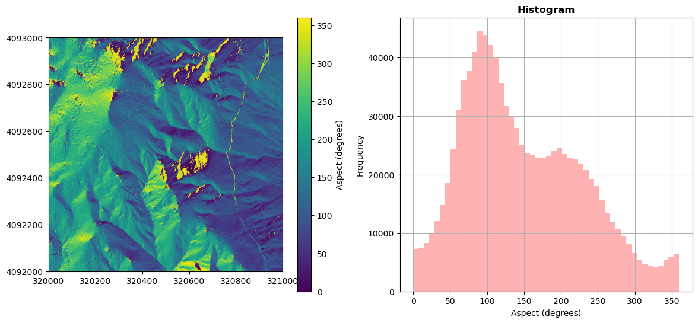
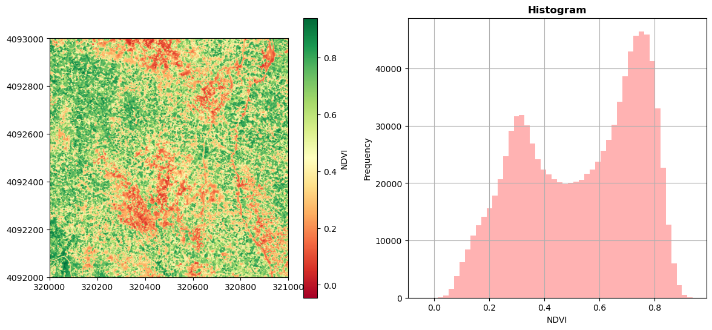
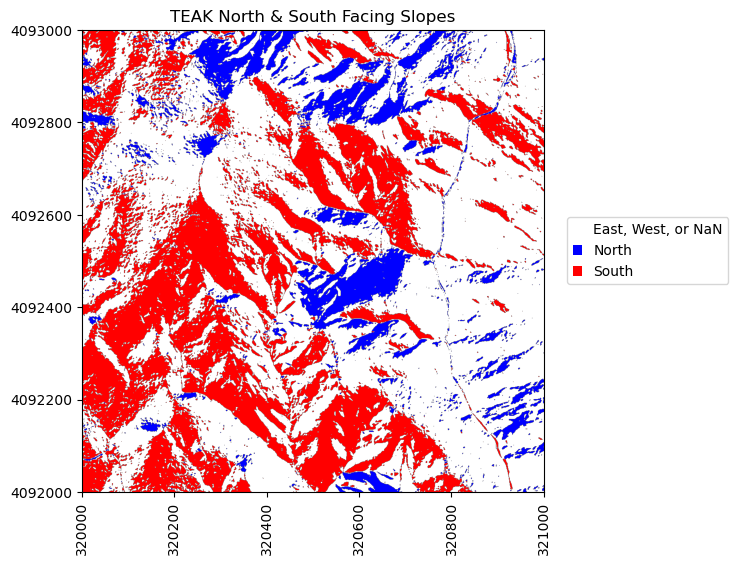
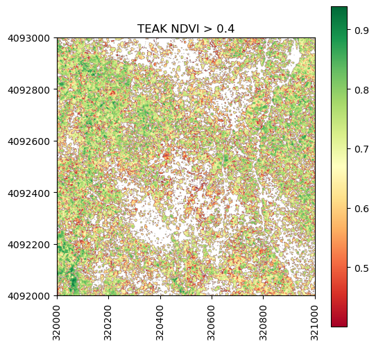
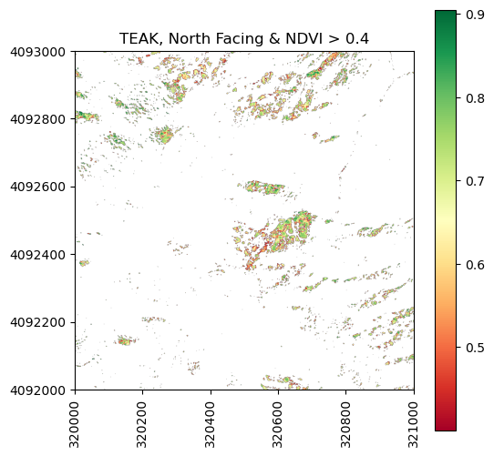
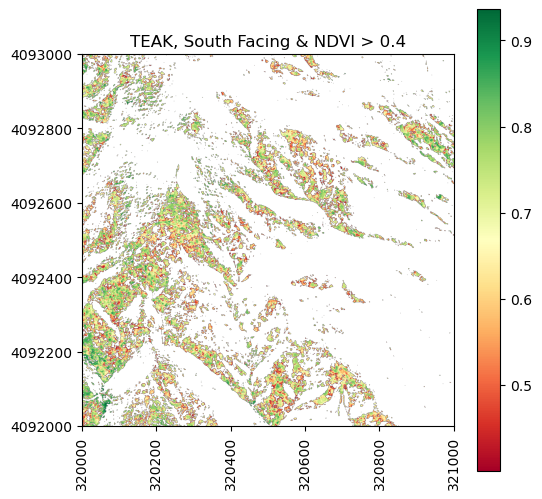

In this tutorial, we demonstrate how to remove parts of a raster based on pixel values using a mask we create. A mask raster layer contains pixel values of either 1 or 0 to where 1 represents pixels that will be used in the analysis and 0 are pixels that are assigned a value of nan (not a number). This can be useful in a number of scenarios, when you are interested in only a certain portion of the data, or need to remove poor-quality data, for example.


<div id="ds-objectives" markdown="1">

### Learning Objectives

After completing this tutorial, you will be able to:

* User rasterio to read in NEON lidar aspect and vegetation indices geotiff files
* Plot a raster tile and histogram of the data values
* Create a mask based on values from the aspect and ndvi data

### Things You’ll Need To Complete This Tutorial

To complete this tutorial, you will need: 
* Python version 3.9 or higher
* Create a <a href="https://www.neonscience.org/about/user-accounts" target="_blank">NEON user account</a>
* Generate an <a href="https://www.neonscience.org/resources/learning-hub/tutorials/api-token-setup" target="_blank">API token</a> for downloading data

#### Install Python Packages

* **gdal** 
* **rasterio**
* **neonutilities**
* **python-dotenv**
* **zipfile**

#### Download Data

For this lesson, we will read in Canopy Height Model data collected at NEON's <a href="https://www.neonscience.org/field-sites/teak" target="_blank">Lower Teakettle (TEAK)</a> site in California. This data is downloaded in the first part of the tutorial, using the Python `neonutilities` package.

</div>


```python
import os
import dotenv
import copy
import neonutilities as nu
import numpy as np
import numpy.ma as ma
import rasterio as rio
from rasterio.plot import show, show_hist
import requests
import zipfile
import matplotlib.pyplot as plt
from matplotlib import colors
import matplotlib.patches as mpatches
%matplotlib inline
```

## Download Lidar Aspect and Vegetation Indices from TEAK

To start, download the NEON Lidar Aspect and Spectrometer Vegetation Indices (including the NDVI) which are provided in geotiff (.tif) format. Use the `neonutilities` `by_tile_aop` function below to download a single tile.

As of June 2026, NEON requires an API token for data downloads, to reduce bot scraping and improve user support. Tokens can be generated in NEON data portal user accounts - log in to your account or create one, and go to the API Tokens section. For best practices in storing and using tokens, follow the instructions <a href="https://www.neonscience.org/resources/learning-hub/tutorials/api-token-setup" target="_blank">here</a>. Once you've set up your token as an environment variable, you can load it using  the `python-dotenv` package as follows, optionally specifying the path to the `.env` file in `load_dotenv()`.


```python
dotenv.load_dotenv()
token = os.environ.get("NEON_TOKEN")
```


```python
# download the Slope and Aspect data to the C:/data directory - change this if desired
nu.by_tile_aop(dpid='DP3.30025.001',
               site='TEAK',
               year=2021,
               easting=320000,
               northing=4092000,
               token=token,
               savepath=r'C:\data')
```

    Provisional NEON data are not included. To download provisional data, use input parameter include_provisional=True.
    

    Continuing will download 3 NEON data files totaling approximately 6.9 MB. Do you want to proceed? (y/n)  y
    

    Downloading 3 NEON data files totaling approximately 6.9 MB
    
    100%|█████████████████████████████████████████████████████████████████████████████████████████████████████████████████| 3/3 [00:01<00:00,  2.88it/s]
    


```python
# download the Vegetation Indices data
nu.by_tile_aop(dpid='DP3.30026.001',
               site='TEAK',
               year=2021,
               easting=320000,
               northing=4092000,
               token=token,
               savepath=r'C:\data')
```

    Provisional NEON data are not included. To download provisional data, use input parameter include_provisional=True.
    

    Continuing will download 2 NEON data files totaling approximately 86.5 MB. Do you want to proceed? (y/n)  y
    

    Downloading 2 NEON data files totaling approximately 86.5 MB
    
    100%|█████████████████████████████████████████████████████████████████████████████████████████████████████████████████| 2/2 [00:03<00:00,  1.78s/it]
    

Display the Slope/Aspect and Vegetation Indices datasets that you downloaded:


```python
aspect_dir = os.path.expanduser(r"C:\data\DP3.30025.001")
veg_idx_dir = os.path.expanduser(r"C:\data\DP3.30026.001")

for root, dirs, files in os.walk(aspect_dir):
    for file in files:
        if file.endswith('Aspect.tif'):
            aspect_file = os.path.join(root, file)
            print(aspect_file)

for root, dirs, files in os.walk(veg_idx_dir):
    for file in files:
        if file.endswith('VegetationIndices.zip'):
            veg_file = os.path.join(root, file)
            print(veg_file)
```

    C:\data\DP3.30025.001\neon-aop-products\2021\FullSite\D17\2021_TEAK_5\L3\DiscreteLidar\AspectGtif\NEON_D17_TEAK_DP3_320000_4092000_Aspect.tif
    C:\data\DP3.30026.001\neon-aop-products\2021\FullSite\D17\2021_TEAK_5\L3\Spectrometer\VegIndices\NEON_D17_TEAK_DP3_320000_4092000_VegetationIndices.zip
    

We can use `zipfile` to unzip the VegetationIndices folder in order to read the NDVI file (which is included in the zipped folder).


```python
with zipfile.ZipFile(veg_file,"r") as zip_ref:
    zip_ref.extractall(r"C:\data\DP3.30026.001\neon-aop-products\2021\FullSite\D17\2021_TEAK_5\L3\Spectrometer\VegIndices")
```


```python
os.listdir(r'C:\data\DP3.30026.001\neon-aop-products\2021\FullSite\D17\2021_TEAK_5\L3\Spectrometer\VegIndices')
```


    ['NEON_D17_TEAK_DP3_320000_4092000_ARVI.tif',
     'NEON_D17_TEAK_DP3_320000_4092000_ARVI_error.tif',
     'NEON_D17_TEAK_DP3_320000_4092000_EVI.tif',
     'NEON_D17_TEAK_DP3_320000_4092000_EVI_error.tif',
     'NEON_D17_TEAK_DP3_320000_4092000_NDVI.tif',
     'NEON_D17_TEAK_DP3_320000_4092000_NDVI_error.tif',
     'NEON_D17_TEAK_DP3_320000_4092000_PRI.tif',
     'NEON_D17_TEAK_DP3_320000_4092000_PRI_error.tif',
     'NEON_D17_TEAK_DP3_320000_4092000_SAVI.tif',
     'NEON_D17_TEAK_DP3_320000_4092000_SAVI_error.tif',
     'NEON_D17_TEAK_DP3_320000_4092000_VegetationIndices.zip']


Now that the files are downloaded, we can read them in using `rasterio`.


```python
aspect_dataset = rio.open(aspect_file)
aspect_data = aspect_dataset.read(1)

# preview the aspect data
aspect_data
```


    array([[185.33 , 174.211, 171.142, ..., 112.737, 112.449, 112.319],
           [176.088, 158.061, 153.006, ..., 114.725, 114.9  , 115.011],
           [167.43 , 158.738, 150.961, ..., 115.534, 116.842, 117.451],
           ...,
           [177.703, 177.827, 173.597, ...,  43.394,  43.034,  46.868],
           [178.709, 179.426, 175.128, ...,  49.758,  49.307,  53.473],
           [178.857, 178.797, 175.642, ...,  56.611,  57.962,  62.06 ]],
          shape=(1000, 1000), dtype=float32)


Define and view the spatial extent so we can use this for plotting later on.


```python
ext = [aspect_dataset.bounds.left,
       aspect_dataset.bounds.right,
       aspect_dataset.bounds.bottom,
       aspect_dataset.bounds.top]
ext
```


    [320000.0, 321000.0, 4092000.0, 4093000.0]


Plot the aspect map and histogram.


```python
fig, (ax1, ax2) = plt.subplots(1, 2, figsize=(14,6))
aspect_map = show(aspect_dataset, adjust=False, ax=ax1);
im = aspect_map.get_images()[0]
fig.colorbar(im, label = 'Aspect (degrees)', ax=ax1) # add a colorbar
ax1.ticklabel_format(useOffset=False, style='plain') # turn off scientific notation

show_hist(aspect_dataset, bins=50, histtype='stepfilled',
          lw=0.0, stacked=False, alpha=0.3, ax=ax2);
ax2.set_xlabel("Aspect (degrees)");
ax2.get_legend().remove()

plt.show();
```


    

    


Classify aspect by direction (North and South)


```python
aspect_reclass = aspect_data.copy()

# classify North and South as 1 & 2
aspect_reclass[np.where(((aspect_data>=0) & (aspect_data<=45)) | (aspect_data>=315))] = 1 #North - Class 1
aspect_reclass[np.where((aspect_data>=135) & (aspect_data<=225))] = 2 #South - Class 2
# West and East are unclassified (nan)
aspect_reclass[np.where(((aspect_data>45) & (aspect_data<135)) | ((aspect_data>225) & (aspect_data<315)))] = np.nan 
```

Read in the NDVI data to a rasterio dataset.


```python
ndvi_file = os.path.join(r'C:\data\DP3.30026.001\neon-aop-products\2021\FullSite\D17\2021_TEAK_5\L3\Spectrometer\VegIndices\NEON_D17_TEAK_DP3_320000_4092000_NDVI.tif')
ndvi_dataset = rio.open(ndvi_file)
ndvi_data = ndvi_dataset.read(1)
```

    

Plot the NDVI map and histogram.


```python
fig, (ax1, ax2) = plt.subplots(1, 2, figsize=(14,6))
ndvi_map = show(ndvi_dataset, adjust=False, cmap = 'RdYlGn', ax=ax1);
im = ndvi_map.get_images()[0]
fig.colorbar(im, label = 'NDVI', ax=ax1) # add a colorbar
ax1.ticklabel_format(useOffset=False, style='plain') # turn off scientific notation

show_hist(ndvi_dataset, bins=50, histtype='stepfilled',
          lw=0.0, stacked=False, alpha=0.3, ax=ax2);
ax2.set_xlabel("NDVI");
ax2.get_legend().remove()

plt.show();
```


    

    


Plot the classified aspect map to highlight the north and south facing slopes.


```python
# Plot classified aspect (N-S) array
fig, ax = plt.subplots(1, 1, figsize=(6,6))
cmap_NS = colors.ListedColormap(['blue','white','red'])
plt.imshow(aspect_reclass,extent=ext,cmap=cmap_NS)
plt.title('TEAK North & South Facing Slopes')
ax=plt.gca(); ax.ticklabel_format(useOffset=False, style='plain') #do not use scientific notation 
rotatexlabels = plt.setp(ax.get_xticklabels(),rotation=90) #rotate x tick labels 90 degrees

# Create custom legend to label N & S
white_box = mpatches.Patch(facecolor='white',label='East, West, or NaN')
blue_box = mpatches.Patch(facecolor='blue', label='North')
red_box = mpatches.Patch(facecolor='red', label='South')
ax.legend(handles=[white_box,blue_box,red_box],handlelength=0.7,bbox_to_anchor=(1.05, 0.45), 
          loc='lower left', borderaxespad=0.);
```


    

    


## Mask Data by Aspect and NDVI
Now that we have imported and converted the classified aspect and NDVI rasters to arrays, we can use information from these to find create a new raster consisting of pixels are North facing and have an NDVI > 0.4.


```python
#Mask out pixels that are north facing:
# first make a copy of the ndvi array so we can further select a subset
ndvi_gtpt4 = ndvi_data.copy()
ndvi_gtpt4[ndvi_data<0.4]=np.nan

fig, ax = plt.subplots(1, 1, figsize=(6,6))
plt.imshow(ndvi_gtpt4,extent=ext)
plt.colorbar(); plt.set_cmap('RdYlGn'); 
plt.title('TEAK NDVI > 0.4')
ax=plt.gca(); ax.ticklabel_format(useOffset=False, style='plain') #do not use scientific notation 
rotatexlabels = plt.setp(ax.get_xticklabels(),rotation=90) #rotate x tick labels 90 degrees
```


    

    


```python
#Now include additional requirement that slope is North-facing (i.e. aspectNS_array = 1)
ndvi_gtpt4_north = ndvi_gtpt4.copy()
ndvi_gtpt4_north[aspect_reclass != 1] = np.nan

fig, ax = plt.subplots(1, 1, figsize=(6,6))
plt.imshow(ndvi_gtpt4_north,extent=ext)
plt.colorbar(); plt.set_cmap('RdYlGn'); 
plt.title('TEAK, North Facing & NDVI > 0.4')
ax=plt.gca(); ax.ticklabel_format(useOffset=False, style='plain') #do not use scientific notation 
rotatexlabels = plt.setp(ax.get_xticklabels(),rotation=90) #rotate x tick labels 90 degrees
```


    

    


It looks like there aren't that many parts of the North facing slopes where the NDVI > 0.4. Can you think of why this might be? 
Hint: consider both ecological reasons and how the flight acquisition might affect NDVI.

Let's also look at where NDVI > 0.4 on south facing slopes.


```python
#Now include additional requirement that slope is Sorth-facing (i.e. aspect_reclass = 2)
ndvi_gtpt4_south = ndvi_gtpt4.copy()
ndvi_gtpt4_south[aspect_reclass != 2] = np.nan

fig, ax = plt.subplots(1, 1, figsize=(6,6))
plt.imshow(ndvi_gtpt4_south,extent=ext)
plt.colorbar(); plt.set_cmap('RdYlGn'); 
plt.title('TEAK, South Facing & NDVI > 0.4')
ax=plt.gca(); ax.ticklabel_format(useOffset=False, style='plain') #do not use scientific notation 
rotatexlabels = plt.setp(ax.get_xticklabels(),rotation=90) #rotate x tick labels 90 degrees
```


    

    


## Export Masked Raster to Geotiff
We can also use rasterio to write out the geotiff file. In this case, we will just copy over the metadata from the NDVI raster so that the projection information and everything else is correct. You could create your own metadata dictionary and change the coordinate system, etc. if you chose, but we will keep it simple for this example.


```python
out_meta = ndvi_dataset.meta.copy()
with rio.open('teak_ndvi_gtpt4_south.tif', 'w', **out_meta) as dst:
    dst.write(ndvi_gtpt4_south, 1)
```

For peace of mind, let's read back in this raster that we generated and confirm that the contents are identical to the array that we used to generate it. We can do this visually, by plotting it, and also with an equality test.


```python
out_file = "teak_ndvi_gtpt4_south.tif"
new_dataset = rio.open(out_file)
show(new_dataset);
```


```python
# use np.array_equal to check that the contents of the file we read back in is the same as the original array 
np.array_equal(new_dataset.read(1),ndvi_gtpt4_south,equal_nan=True)
```
